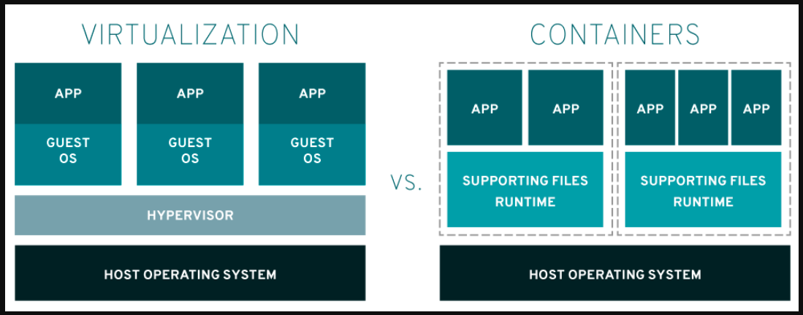
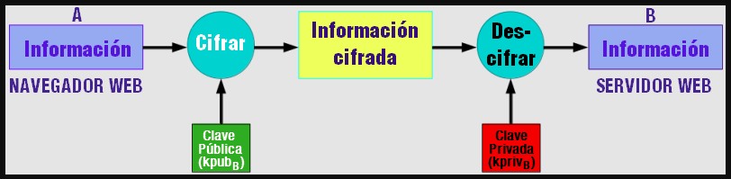
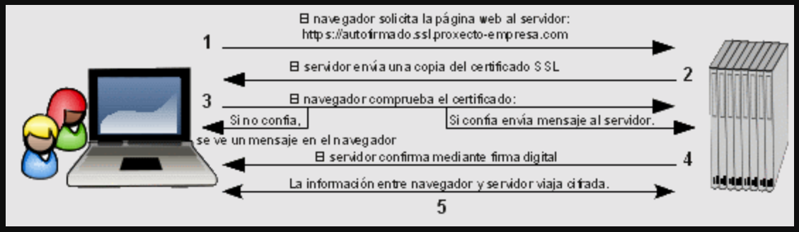
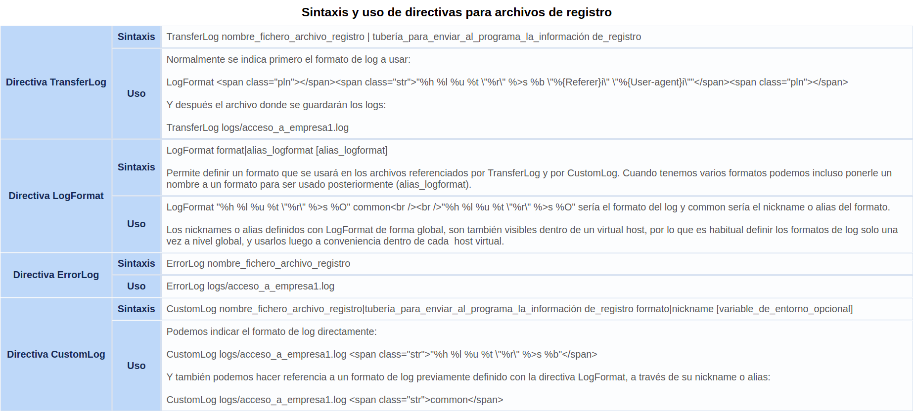
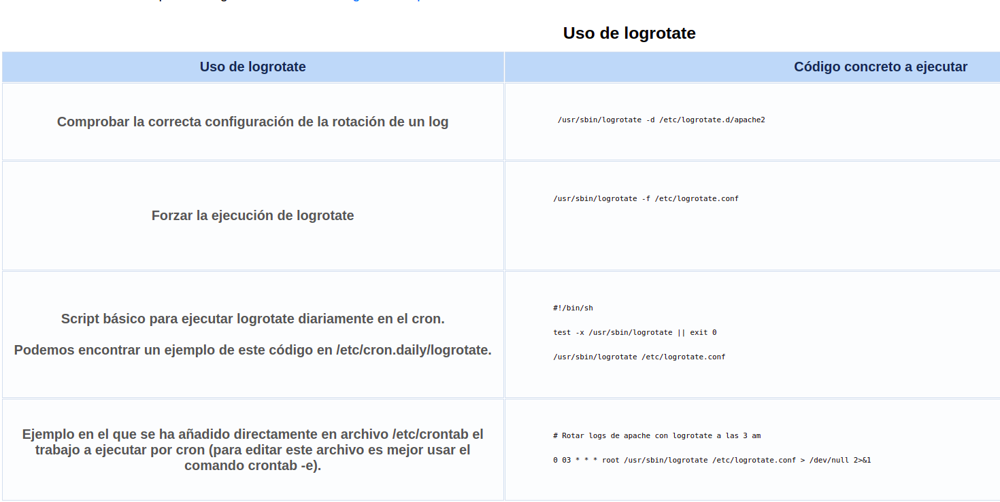

# Implantación, configuración y administración de servidores web.

Hablar de la web puede parecer simple, pero detrás de su funcionamiento existe una infraestructura compleja de estándares y protocolos que hacen posible la comunicación entre aplicaciones. Estas aplicaciones, por lo general, se ejecutan en sistemas distintos: una en un servidor remoto, conocido como servidor web, y otra en el dispositivo del usuario, mediante un navegador web.

Las tecnologías que sustentan la web, en su mayoría basadas en estándares abiertos, se han convertido en la base del desarrollo moderno en Internet. Actualmente, su uso va mucho más allá de la interacción entre navegador y servidor: también permiten que diferentes sistemas y servicios intercambien datos entre sí, a través de lo que conocemos como API web o servicios web.

Un ejemplo ampliamente utilizado de esta comunicación es el modelo REST, que utiliza protocolos como HTTP y formatos de datos modernos como JSON para facilitar el intercambio de información entre aplicaciones. Además, han surgido alternativas más flexibles como GraphQL, que permite a los clientes definir exactamente qué datos necesitan, optimizando así el rendimiento y la eficiencia de las comunicaciones.

Gracias a estas tecnologías, hoy es posible desarrollar aplicaciones web y móviles que se integran fácilmente con otros servicios en línea, como Twitter, Facebook, o plataformas de terceros, creando ecosistemas digitales más conectados e interoperables.

En el desarrollo de aplicaciones web, los **servicios web** juegan un papel crucial al permitir que diferentes sistemas y aplicaciones se comuniquen entre sí a través de internet. Esto se logra mediante protocolos estándar que facilitan el intercambio de datos entre aplicaciones, incluso si están escritas en diferentes lenguajes de programación o funcionan en plataformas distintas.

En términos generales, cuando se empiezan a utilizar servicios web en una organización, éstos se desarrollan e implementan como servicios simples, que poco a poco se van integrando hasta llegar a servicios web mucho más complejos.

Desde sus humildes comienzos, los **servicios web** han evolucionado de manera notable, adaptándose a las nuevas necesidades de los usuarios y a los avances tecnológicos. En sus primeras etapas, la web era un lugar estático, limitado en sus funcionalidades y muy alejado de lo que conocemos hoy. Los primeros servicios web eran simples, sin mucha interactividad. Los usuarios podían acceder a información, pero no podían hacer mucho más que leerla. Las páginas web eran mayormente estáticas y los recursos eran limitados, lo que ofrecía una experiencia bastante básica.

Con el paso de los años, la web dio un giro importante con la llegada de la Web 2.0, en la que la interactividad se convirtió en el centro de la experiencia. Durante esta etapa, las páginas web comenzaron a transformarse de simples documentos estáticos a aplicaciones interactivas donde los usuarios ya no solo consumían contenido, sino que también lo generaban. Nació la idea de **redes sociales, blogs y plataformas de compartición de videos** que permitían a las personas participar activamente. La web ya no era un espacio donde solo se leía información, sino un lugar donde los usuarios podían comunicarse, compartir experiencias y colaborar en línea. Las tecnologías como AJAX mejoraron la interacción en tiempo real sin necesidad de recargar toda la página, lo que transformó la web en algo mucho más dinámico y atractivo.

A medida que los dispositivos móviles comenzaron a ser más populares, los servicios web tuvieron que adaptarse para ofrecer una experiencia optimizada en smartphones y tablets. Surgieron los **sitios web responsivos**, aquellos que se adaptan a diferentes tamaños de pantalla, y las PWA, que permiten a los usuarios acceder a las funcionalidades completas de un sitio web, incluso cuando están offline. Los usuarios ya no estaban atados a sus computadoras de escritorio; podían acceder a sus servicios web desde cualquier lugar, en cualquier momento, con una experiencia que ya era casi tan buena como las aplicaciones nativas de los dispositivos.

Sin embargo, la revolución no se detuvo allí. A medida que la **computación en la nube** comenzó a ganar terreno, los servicios web se hicieron mucho más escalables y eficientes. La infraestructura física ya no era un problema: ahora los servicios web podían alojarse en **nubes públicas o privadas**, lo que les permitió crecer o reducirse según la demanda. El concepto de microservicios cobró fuerza, permitiendo a los desarrolladores dividir grandes aplicaciones en pequeñas piezas que podían escalar independientemente. Así, los servicios web se volvieron más flexibles, rápidos y capaces de ofrecer una experiencia mucho más fluida.

Con la llegada de la Web 3.0, los servicios web empezaron a incorporar tecnologías más avanzadas. La web se volvió **más inteligente y personalizada**. El uso de IA y algoritmos de aprendizaje automático permitió a los servicios anticiparse a las necesidades de los usuarios, ofreciéndoles recomendaciones y experiencias más relevantes. La **web semántica** comenzó a cobrar importancia, permitiendo a los servicios comprender el significado de los datos en lugar de solo mostrar información. Además, la **descentralización** comenzó a ser una tendencia relevante gracias a tecnologías como blockchain, que permitieron construir servicios web más seguros y transparentes, sin la necesidad de depender de servidores centralizados.

Ahora, en un futuro cercano, se está perfilando la Web 4.0, un concepto aún en desarrollo que promete transformar aún más la forma en que interactuamos con la web. Se espera que los servicios web sean cada vez más autónomos, aprovechando los avances en computación cuántica e inteligencia artificial avanzada. En esta nueva etapa, los servicios web podrían anticipar nuestras necesidades antes de que las expreses, adaptándose de manera aún más precisa a tus hábitos y preferencias. Las interfaces de usuario también podrían evolucionar, y la **interacción natural** (como voz o gestos) reemplazará los teclados y pantallas táctiles, haciendo la experiencia mucho más fluida y natural.

## 1.- Implantación de arquitecturas web.

> La arquitectura web clásica o tradicional se basa comúnmente en un modelo de tres capas: la **capa de datos**, donde se almacenan y gestionan los datos mediante bases como PostgreSQL o MongoDB; la **capa de lógica de negocio** o backend, que procesa las solicitudes y aplica las reglas del sistema usando tecnologías como Node.js, Django o Spring Boot, y expone APIs REST o GraphQL; y la **capa de presentación o frontend**, que es la interfaz de usuario que interactúa con esas APIs, desarrollada con tecnologías como React, Vue o Angular. Aunque este modelo sigue siendo fundamental, hoy en día muchas aplicaciones evolucionan hacia arquitecturas distribuidas como microservicios o serverless.

La **arquitectura web** es el diseño y la estructura de los componentes que hacen posible que un sitio web o una aplicación web funcione.

La arquitectura web moderna está compuesta por varios elementos fundamentales que trabajan en conjunto para que una aplicación o sitio web funcione correctamente. Estos elementos se encargan de la interacción con el usuario, el procesamiento de la información y el almacenamiento de datos, y son los siguientes:

- **Front-end (Lado del cliente):**
  El front-end es la parte visible y con la que los usuarios interactúan directamente en una aplicación o página web. Todo lo que el usuario ve en su pantalla, como el diseño, los botones, las imágenes, los formularios y la interactividad, forma parte del front-end. Este componente se encarga de mostrar la información y hacerla accesible para el usuario.
  Las tecnologías más comunes utilizadas en el front-end incluyen HTML para la estructura, CSS para los estilos y el diseño, y JavaScript para la interactividad. Además, se utilizan frameworks como React, Vue.js y Angular para facilitar el desarrollo y mejorar la experiencia del usuario.

- **Back-end (Lado del servidor):**
  El back-end es la parte que no es visible para el usuario, pero que es esencial para el funcionamiento de la aplicación. Es responsable de la lógica de negocio, el procesamiento de datos y la gestión de las solicitudes del cliente. Cuando un usuario realiza una acción en el front-end (como enviar un formulario o hacer clic en un enlace), el back-end se encarga de procesar esa solicitud, acceder a la base de datos si es necesario, y devolver la respuesta al front-end. Las tecnologías más utilizadas en el back-end incluyen lenguajes de programación como Node.js, Python (con frameworks como Django y Flask), Ruby on Rails, PHP, Java y .NET.

- **Base de Datos:**
  La base de datos es donde se almacenan y gestionan los datos de la aplicación, como los usuarios, productos, publicaciones o cualquier otra información relevante. Dependiendo del tipo de datos y la estructura de la aplicación, se pueden usar bases de datos relacionales (como MySQL y PostgreSQL) o no relacionales (como MongoDB). La base de datos es esencial para guardar la información de manera organizada y permitir su recuperación rápida y eficiente cuando sea necesario.

- **API (Interfaz de Programación de Aplicaciones):**
  Las APIs actúan como el "puente" entre el front-end y el back-end. Son conjuntos de reglas y protocolos que permiten que las aplicaciones se comuniquen entre sí, enviando y recibiendo datos. A través de las APIs, el front-end puede hacer solicitudes al back-end para obtener información o realizar acciones, como consultar datos en la base de datos o procesar pagos. Las APIs pueden seguir diferentes arquitecturas, siendo las más comunes REST y GraphQL.

- **Servidor Web:**
  El servidor web es el encargado de recibir las solicitudes HTTP (como las que se envían al escribir una URL en el navegador) y redirigirlas al back-end para su procesamiento. Además, se encarga de entregar los archivos estáticos del front-end (como imágenes, hojas de estilo o scripts) al navegador del usuario. Los servidores web más populares son Apache, Nginx y Microsoft IIS.

### 1.1.- Características de la arquitecturas web.

Las características de una arquitectura web deben asegurar que esta sea eficiente, segura y fácil de mantener, adaptándose al crecimiento y a nuevos requerimientos. Son las siguientes:

- **Escalabilidad**: capacidad de manejar un aumento en el tráfico o datos sin afectar el rendimiento. Permite que la aplicación crezca sin problemas.

- **Flexibilidad**: permite adaptarse a cambios y nuevas tecnologías, facilitando la integración de nuevas funcionalidades sin afectar el sistema.

- **Rendimiento**: garantiza respuestas rápidas a las solicitudes de los usuarios, asegurando una experiencia fluida y eficiente

- **Seguridad**: protege los datos sensibles mediante medidas como cifrado, autenticación y prevención de ataques cibernéticos.

- **Mantenibilidad**: facilita la actualización y mantenimiento de la aplicación, permitiendo hacer cambios o correcciones sin complicaciones.

- **Modularidad**: divide la aplicación en componentes independientes, permitiendo desarrollarlos, probarlos y actualizarlos por separado.

- **Alta disponibilidad:** asegura que la aplicación esté operativa todo el tiempo, incluso si una parte del sistema falla, mediante redundancia y recuperación rápida.

- **Interoperabilidad**: permite la integración con otros sistemas y servicios externos, facilitando la comunicación mediante APIs.

### 1.2.- Modelos de arquitecturas web.

La evolución de las arquitecturas web es una respuesta a la necesidad de construir aplicaciones más robustas, escalables, eficientes y flexibles, capaces de satisfacer las demandas de un mundo digital en constante cambio. Los distintos modelos de aplicación sobre los que se ha ido desarrollando, según diversos autores, se podrían clasificar del siguiente modo:

**Arquitectura Cliente-Servidor: El Diálogo Fundamental de la Web**

En el corazón de la interacción en la web yace la arquitectura cliente-servidor, un modelo tan básico como esencial. Imagina una conversación: tú, el cliente, expresas una necesidad o pregunta (una solicitud) a un proveedor de información, el servidor. Este último, tras procesar tu petición, te responde con la información solicitada (una respuesta). En el ámbito web, esta interacción se traduce en tu navegador (el cliente) solicitando páginas web, imágenes o datos a un servidor, que a su vez entrega estos recursos para que se muestren en tu pantalla. La sencillez de este modelo es su fortaleza, siendo la base sobre la que se construyen la inmensa mayoría de las aplicaciones y sitios web.

**Arquitectura de 3 capas: La Organización Jerárquica de la Aplicación**

A medida que las aplicaciones web se vuelven más complejas, surge la necesidad de una mayor organización. La arquitectura de 3 capas responde a esta necesidad dividiendo la aplicación en tres componentes lógicos: la capa de presentación, la capa de lógica de negocio y la capa de datos. La capa de presentación es el rostro de la aplicación, lo que el usuario ve e interactúa. La capa de lógica de negocio actúa como el cerebro, procesando datos y aplicando reglas. Finalmente, la capa de datos es el almacén, donde se guarda y recupera la información. Esta separación permite que cada capa se desarrolle y mantenga de forma independiente, mejorando la escalabilidad y la mantenibilidad de la aplicación.

**Arquitectura MVC (Modelo-Vista-Controlador): La Armonía de la Separación de Responsabilidades**

El patrón de diseño Modelo-Vista-Controlador (MVC) lleva la organización un paso más allá, separando aún más las responsabilidades dentro de la aplicación. El modelo representa los datos y la lógica, la vista define la interfaz de usuario, y el controlador actúa como intermediario, gestionando las interacciones del usuario y actualizando el modelo y la vista según sea necesario. Esta separación facilita la colaboración entre desarrolladores, ya que cada uno puede centrarse en su área de especialización, y promueve la reutilización de código.

**Arquitectura de Microservicios: La Descentralización para la Escalabilidad y la Resiliencia**

En el mundo de las aplicaciones a gran escala, la arquitectura de microservicios se ha convertido en una opción cada vez más popular. En lugar de construir una aplicación monolítica, se divide en pequeños servicios independientes, cada uno responsable de una función específica. Estos microservicios se comunican entre sí a través de APIs , lo que permite una mayor flexibilidad y escalabilidad. Si un microservicio falla, los demás pueden seguir funcionando, lo que mejora la resiliencia de la aplicación.

**Arquitectura Serverless: La Abstracción de la Infraestructura**

La arquitectura serverless lleva la abstracción a su máxima expresión. Los desarrolladores se centran exclusivamente en escribir el código de la aplicación, sin preocuparse por la infraestructura subyacente. El proveedor de la nube se encarga de aprovisionar y escalar los recursos según sea necesario, lo que reduce la complejidad operativa y los costos de mantenimiento. La arquitectura serverless es ideal para aplicaciones con patrones de tráfico variables y funciones que se ejecutan de forma intermitente.

> La arquitectura más utilizada entre las mencionadas sigue siendo la **Arquitectura Cliente-Servidor**. Esta es la base sobre la que se construyen la mayoría de las aplicaciones web, ya que todas ellas, sin importar su complejidad o evolución hacia otros modelos como MVC o microservicios, dependen de esta estructura fundamental de solicitud y respuesta entre un cliente (por ejemplo, el navegador) y un servidor. Sin embargo, en aplicaciones modernas y más complejas, la **arquitectura de 3 capas y MVC** son también ampliamente utilizadas, especialmente en combinación. Y en entornos de gran escala o con necesidades específicas de escalabilidad y resiliencia, están ganando terreno los **microservicios** y la **arquitectura serverless**.

**🔴Para saber más**
Una plataforma web es el entorno de desarrollo de software empleado para diseñar y ejecutar un sitio web. En términos generales, una plataforma web consta de cuatro componentes básicos:

1. El **sistema operativo**,bajo el cual opera el equipo donde se hospedan las páginas web y que representa la base misma del funcionamiento del computador. En ocasiones limita la elección de otros componentes.

2. El **servidor web** es el software que maneja las peticiones desde equipos remotos a través de la Internet. En el caso de páginas estáticas, el servidor web simplemente provee el archivo solicitado, el cual se muestra en el navegador. En el caso de sitios dinámicos, el servidor web se encarga de pasar las solicitudes a otros programas que puedan gestionarlas adecuadamente.

3. El **gestor de bases de datos** se encarga de almacenar sistemáticamente un conjunto de registros de datos relacionados para ser usados posteriormente.

4. Un **lenguaje de programación interpretado** que controla las aplicaciones de software que corren en el sitio web.

Diferentes combinaciones de los cuatro componentes señalados, basadas en las distintas opciones de software disponibles en el mercado, dan lugar a numerosas plataformas web, aunque, sin duda, hay dos que sobresalen del resto por su popularidad y difusión: LAMP(Linux, Apache, MySQL, PHP) y WISA(Windows, IIS, Microsoft SQL, ASP).

[Vídeo](https://www.youtube.com/watch?v=lC6JOQLIgp0) explicativo de la arquitectura cliente-servidor y aspectos generales.

### 1.3.- Servidor web.

Uno de los elementos de la arquitectura web, como ya vimos en el inicio del apartado es el servidor web. El servidor web es el componente que se encarga de recibir las solicitudes HTTP (o HTTPS) de los clientes y de entregar los recursos solicitados. Es responsable de manejar las interacciones entre el navegador del usuario y la aplicación web.

Como supondrás, cuando accedemos a un sitio web a través de un navegador web, el navegador web inicia una o más comunicaciones con un sistema remoto y se produce un intercambio de paquetes que permite mostrar la página web. Veamos el proceso más detalladamente:

- El navegador realiza una petición de un recurso al servidor web (imagen, HTML, etc.).
- El servidor web recibe la petición y la procesa. Procesar la petición en el servidor web puede significar dos cosas diferentes:
  - Servir un recurso estático, es decir, el contenido de un archivo almacenado en el disco del servidor.
  - Ejecutar una aplicación en el servidor que genere contenido dinámico.
- El navegador web recibe el contenido del servidor y es el encargado de mostrarlo al usuario final, a través de un proceso conocido como renderizado. En el proceso de renderizado el navegador web convierte los datos recibidos en información que el usuario puede ver en la pantalla de su ordenador.
- Si para renderizar y representar la página web el navegador necesita más recursos (imágenes, archivos CSS, etc.), los volvería a pedir al navegador, siguiendo el proceso anterior.

El protocolo que permite todo ese proceso anterior es HTTP. HTTP es el protocolo que permite al navegador realizar una petición y al servidor generar una respuesta, y es importante entenderlo antes de configurar un servidor web.

Los servidores web más relevantes actualmente:

- **Apache HTTP Server:** Es uno de los servidores más populares, conocido por su flexibilidad y extensibilidad. Es ideal para aplicaciones que requieren configuraciones personalizadas y es compatible con varios sistemas operativos.
- **Nginx**: Destaca por su alto rendimiento y eficiencia en la gestión de grandes cantidades de tráfico. Utiliza un modelo de eventos asíncrono, lo que lo hace muy adecuado para sitios con alta demanda y aplicaciones dinámicas.
- **LiteSpeed**: Ofrece alto rendimiento y es especialmente eficiente con aplicaciones dinámicas como WordPress. Incluye un sistema de caché integrado y soporta HTTP/HTTP/3 para mejorar la velocidad.
- **Microsoft IIS:** El servidor web de Microsoft, optimizado para entornos Windows, ideal para aplicaciones basadas en tecnologías de Microsoft como .NET y SQL Server.
- **Caddy**: Conocido por su facilidad de uso y configuración automática de HTTPS, es una excelente opción para desarrolladores que buscan una solución sencilla y segura.

Su funcionamiento se basa en varios conceptos esenciales:

- **Protocolo HTTP/HTTPS:** El servidor web usa los protocolos HTTP y HTTPS para comunicar al cliente (navegador) con el servidor. HTTP maneja la solicitud y respuesta de datos, mientras que HTTPS cifra esa comunicación para garantizar la seguridad de la información.
- **Solicitudes y Respuestas:** El servidor web recibe solicitudes HTTP desde el cliente (generalmente un navegador) y responde enviando los recursos solicitados, como páginas web (HTML), imágenes o archivos estáticos. Si la solicitud es dinámica, el servidor puede procesarla mediante un servidor de aplicaciones o enviar datos generados en tiempo real.
- **Archivos Estáticos y Dinámicos:** Los servidores web entregan tanto archivos estáticos (como HTML, CSS, y JavaScript) como archivos dinámicos, los cuales son generados en el servidor en función de la solicitud del usuario. Los archivos estáticos se entregan tal como están, mientras que los archivos dinámicos requieren procesamiento adicional.
- **Configuración**: Los servidores web se configuran mediante archivos específicos (como httpd.conf en Apache o nginx.conf en Nginx) que controlan aspectos como las rutas de archivos, las políticas de seguridad y el manejo de errores. Estos archivos permiten adaptar el comportamiento del servidor a las necesidades de la aplicación.
- **Puertos**: Los servidores web generalmente escuchan en los puertos 80 (para HTTP) y 443 (para HTTPS) para recibir las solicitudes de los usuarios.
- **Servidor Web vs. Servidor de Aplicaciones:** Aunque el servidor web maneja las solicitudes HTTP y entrega archivos estáticos, las solicitudes que requieren procesamiento dinámico se redirigen al servidor de aplicaciones. Este último procesa la lógica de negocio y genera la respuesta, que luego es entregada al usuario.
- **Manejo de Errores:** Los servidores web gestionan errores como el 404 Not Found cuando el recurso solicitado no está disponible o el 500 Internal Server Error cuando ocurre un fallo en el servidor. Estas respuestas informan al cliente sobre el estado de la solicitud.
- **Seguridad**: Para proteger la comunicación entre el servidor y el cliente, se utiliza HTTPS y certificados SSL/TLS. Además, el servidor debe configurarse adecuadamente para prevenir vulnerabilidades de seguridad como ataques DDoS o inyecciones de código malicioso.
- **Redirección y Reescritura de URL:** El servidor web puede redirigir solicitudes de una URL a otra, como redirigir de HTTP a HTTPS, o reescribir URLs para mejorar la accesibilidad o estructura del sitio web.
- **Manejo de Caché**: El servidor web puede almacenar en caché los recursos solicitados con frecuencia para mejorar el rendimiento. Esta técnica evita que los recursos se carguen repetidamente desde el servidor, acelerando la respuesta al usuario.

### 1.4.- El protocolo HTTP.

El protocolo HTTP permite realizar la transferencia de información entre un cliente web y un servidor web en Internet, dando lugar a lo que hoy día se conoce como World Wide Web. Este protocolo ha pasado por varias versiones, desde la inicial 0.9 hasta la actual 3.0 (HTTP/3). La versión más extendida actualmente es la versión HTTP/2, definido en el RFC 9113, pero la versión 3.0 se irá imponiendo poco a poco de forma natural.

El protocolo HTTP es muy simple, por lo que cuando desarrollamos una aplicación web es necesario que cosas como la autenticación sea implementada por la aplicación web, dado que el protocolo no provee de mecanismos para ello.

Para el seguimiento del usuario, y en consecuencia, para la gestión de la información de sesión, se utilizan cookies. Las cookies son pequeños archivos de textos almacenados en el sistema del cliente, donde se guarda temporalmente información que proviene del servidor web. La aplicación web generará una "cookie" que el cliente web almacenará durante un periodo de tiempo, y el cliente web volverá a enviar al servidor web dicha cookie cada vez que se haga una petición a la misma aplicación web. De esta forma, la aplicación web que se ejecuta en un servidor web podrá almacenar en el cliente información, como por ejemplo los productos que el usuario visito anteriormente o el listado de productos que tiene almacenado en el carrito de la compra.

El protocolo HTTP permite realizar la transferencia de información entre un cliente web y un servidor web en Internet, dando lugar a lo que hoy día se conoce como World Wide Web. Este protocolo ha pasado por varias versiones, desde la inicial 0.9 hasta la actual 3.0 (HTTP/3). La versión más extendida actualmente es la versión HTTP/2, definido en el RFC 9113, pero la versión 3.0 se irá imponiendo poco a poco de forma natural.

La comunicación en el protocolo HTTP se basa en un modelo basado en peticiones y respuestas:

- Petición (Request): El cliente envía una petición al servidor para recuperar un recurso específico. La petición incluye información como el método HTTP seleccionado (GET, POST, etc.), la URL del recurso y los encabezados HTTP necesarios.
- Respuesta (Response): El servidor recibe la petición y responde con la información solicitada, junto con un código de estado HTTP (Ejemplo: 200 OK o 404 Not Found) y encabezados adicionales. La respuesta puede incluir datos en HTML, imágenes, archivos JSON, etc.

Cuando un cliente web (un navegador por ejemplo) accede a un recurso, se sigue el siguiente procedimiento:

- El cliente web se conecta al servidor web.
- El cliente web envía una petición al servidor. Existen diferentes métodos para realizar la petición, los más comunes son los métodos GET y POST.
- El servidor envía una respuesta al cliente, donde, si todo ha ido bien, se incluye el tipo de contenido, su longitud y el contenido en sí.

Para entender mejor este proceso, veamos un ejemplo de comunicación entre un cliente web y navegador web. Supongamos que en un navegador web ponemos la URL siguiente: [https://www.docker.com/products/docker-desktop/](https://www.docker.com/products/docker-desktop/). En este caso nuestro navegador se pondrá en contacto con el sistema www.docker.com y enviará una petición HTTP usando el método GET que tendrá el siguiente aspecto:

```
GET / HTTP/1.1
Host: www.docker.com
User-Agent: curl/7.64.1
Accept: _*_
```

La petición anterior comienza indicando el método HTTP (GET), el recurso (`/<a href="https://www.docker.com/products/docker-desktop/">products/docker-desktop/</a>`) y la versión del protocolo HTTP (HTTP/1.1). A continuación, el navegador incluye varias cabeceras de petición (Content-type, Server, Accept, Cookie, etc.) que le permitirán al servidor web, y a una potencial aplicación web que procese la petición HTTP, generar una respuesta más completa. El servidor responderá con una respuesta que tendrá el siguiente aspecto:

```
HTTP/1.1 200 OK
Date: Tue, 02 Apr 2025 12:00:00 GMT
Content-Type: text/html; charset=UTF-8
Content-Length: 4598
Connection: keep-alive
```

El trozo anterior es solamente la cabecera de respuesta, que comienza por la versión del protocolo HTTP (HTTP/1.1), seguido de un código de respuesta (200) y un texto que dependiendo del caso puede variar (en el caso del código 200 suele ser un OK o Document follows). Después de esa primera parte, se incluyen varias cabeceras de respuesta (Date, Content-type, Connection, ...) con información que el cliente web debe tener en cuenta. ¿Y dónde va la información? Justo después de terminar las cabeceras, el servidor incluirá una línea vacía y, a continuación, el documento o recurso, por ejemplo, el código HTML de la página solicitada:

```html
<html>
  <head>
    <title>Docker</title>
  </head>
  <body>
    <h1>Welcome to Docker</h1>
    <p>...</p>
  </body>
</html>
```

> La principal diferencia de HTTP/3 es que HTTP/3 mejora significativamente el rendimiento en **entornos de red inestables**, especialmente en conexiones móviles, gracias a **QUIC**. El uso de **UDP** y el cifrado incorporado le dan ventajas en términos de **latencia** y **seguridad**. En cambio, HTTP/2 sigue utilizando **TCP**, lo que lo hace menos eficiente en entornos con **alta latencia** o **pérdida de paquetes**. Si estás desarrollando aplicaciones modernas o trabajando con redes móviles, HTTP/3 es el futuro, pero HTTP/2 sigue siendo muy útil y ampliamente adoptado en la mayoría de los casos.

### 1.5.- Protocolo HTTP vs HTTPS.

¿Quieres conservar la información de forma confidencial?¿Quieres transferir información de forma segura? Si estás pensando en este tipo de preguntas necesariamente estás pensando en el protocolo HTTPS y no en el protocolo HTTP.

El protocolo HTTPS permite que la información viaje de forma segura entre el cliente y el servidor, por la contra el protocolo HTTP envía la información en texto claro, esto es, cualquiera que accediese a la información transferida entre el cliente y el servidor puede ver el contenido exacto y textual de la información.

Para asegurar la información, el protocolo HTTPS requiere de certificados y siempre y cuando sean validados la información será transferida cifrada. Pero cifrar la información requiere un tiempo de computación, por lo que será perjudicado el rendimiento del servidor web. Así, ¿es necesario que toda, absolutamente toda, la información sea transferida entre el cliente y servidor de forma cifrada? A lo mejor solamente es necesario que sea cifrada la autenticación a dicha información, por eso en algunas páginas web puede que el servidor esté configurado para que en todo el dominio esté cifrada su información o simplemente el intento de acceso a la misma.

Un servidor web, como Apache, puede emitir certificados, pero puede que en algún navegador sea interpretado como peligroso, esto suele ser debido a que los navegadores poseen en su configuración una lista de Entidades Certificadoras que verifican, autentican y dan validez a los certificados. ¿Tú, confiarías en un DNI que no fuese certificado por una entidad de confianza como el Ministerio del Interior? Pues, lo mismo le pasa a los navegadores, solamente confían en quien confían. Eso no quiere decir que no puedes crear tus certificados en un servidor web, de hecho muchas empresas lo hacen, sobre todo para sitios internos o externos en los que solamente puede acceder personal autorizado por la propia empresa. Ahora si, si utilizas certificados mediante Apache en un sitio visible a través de Internet y accesible por cualquier usuario, o bien eres una empresa o entidad en la que de por si confía el usuario o la imagen de la empresa o entidad quedará muy mal parada, ya que lo más probable es que el usuario no aceptará la comunicación, por visionar en el navegador un aviso de problema de seguridad.

El protocolo HTTPS utiliza el protocolo de seguridad **TLS (Transport Layer Security)** para cifrar la comunicación entre el cliente (navegador) y el servidor. Antes de TLS, se usaba SSL (Secure Sockets Layer), pero este ha quedado obsoleto debido a vulnerabilidades de seguridad. Entonces, si necesitas que la información viaje cifrada debes emplear el protocolo HTTPS, en caso contrario el protocolo HTTP. Hay que dejar claro que la utilización del protocolo HTTPS no excluye ni impide el protocolo HTTP, los dos pueden convivir en un mismo dominio.

Bien, pero, ¿cómo funcionan? Más o menos hemos visto ya el funcionamiento pero vamos a revisarlo para entender la diferencia con HTTPS. Cuando escribes una dirección URL en el navegador, por ejemplo http://www.debian.org/index.es.html, antes de ver la página en el navegador existe todo un juego de protocolos que entran en acción, sin profundizar en todos ellos, vamos ver el proceso que ocurre:

- Se traduce el dominio DNS por una dirección IP (en este caso www.debian.org se traduce a una dirección IP).
- Una vez obtenida la dirección IP se accede al sistema remoto que tiene dicha IP, concretamente al puerto 80, que es el puerto TCP asignado por defecto al protocolo HTTP.
- El cliente web entonces realiza la petición HTTP, solicitando un recurso (en este caso podría ser GET /index.es.html HTTP/1.1, por ejemplo).
- Si el servidor web aloja la página, ésta será transferida a tu navegador en la respuesta HTTP.

Sin embargo cuando escribes en el navegador una dirección URL con llamada al protocolo HTTPS, el procedimiento es similar al anterior pero un poco más complejo:

- Se traduce el dominio DNS por una IP.
- Una vez que se obtiene la IP, se busca en el servidor web que aloja la página solicitada el puerto 443, puerto TCP asignado por defecto al protocolo HTTPS.
- Pero ahora, antes de transferir la página a tu navegador se inicia una negociación llamada "Handshake TLS", en la que entre otras cosas el servidor envía su certificado de seguridad al navegador (el navegador, aunque es poco habitual, también puede enviar el suyo), y si el certificado está firmado por un Entidad Certificadora de confianza, el cliente web aceptará el certificado y se usará un canal seguro de comunicación, donde toda la información irá cifrada

<div style="text-align: center">
    
</div>

- Una vez verificado el certificado servidor, se realiza el proceso de petición HTTP y respuesta HTTP pero de forma cifrada.

Puedes hacer que un servidor web para una determinada página acepte los protocolos HTTP y HTTPS en puertos TCP distintos del 80 y 443 respectivamente. Eso sí, cuando visites la página web, en la dirección URL debes especificar el puerto TCP. Por ejemplo, si nuestro servidor atiende peticiones HTTP en el puerto 8080 deberíamos poner http://www.tupagina.local:8080, de esta forma el cliente web enviará la petición de la página www.tupagina.local al puerto 8080. Del mismo modo si nuestro servidor atiende peticiones HTTPS en el puerto 4333, deberíamos escribir la url en el navegador de la siguiente forma: https://www.tupagina.local:4333. Como ves, puedes cambiar los puertos por defecto, pero ten en cuenta que cualquiera que quisiera acceder a esas páginas debería saber el puerto TCP de la solicitud. Entonces, ¿quiere decir que aunque no escribas el puerto TCP en las direcciones URL estas se interpretan en el puerto 80 y 443 para el protocolo HTTP y HTTPS respectivamente? Pues si, así es. Es lo mismo escribir http://www.tupagina.local:80 que http://www.tupagina.local y es lo mismo escribir https://www.tupagina.local:443 que https://www.tupagina.local.

### 1.6.- Uso del servicio HTTP.

Ahora que ya conocemos los fundamentos del protocolo HTTP, vamos a profundizar un poco más en él. Para empezar, veamos los principales métodos (también llamado "verbos") usados para realizar una petición al servidor web.

- Método **GET**: se usa para obtener un recurso, y en general, no admite que el cliente web envíe datos al servidor. Si queremos usar este método para enviar datos al servidor los datos deben formar parte del recurso solicitado, usando por ejemplo una cadena de consulta (query string). Por ejemplo:
  - Si ponemos la url http://www.estoesunejemplo.com/mipagina.php, se generaría una petición HTTP del estilo a GET /mipagina.php HTTP/1.1.
  - Si ponemos la url http://www.estoesunejemplo.com/mipagina.php?dato1=a&dato2=2, se generaría una petición HTTP del estilo a GET /mipagina.php?dato1=a&dato2=2 HTTP/1.1. La diferencia con el anterior es que se ha añadido una cadena de consulta que se procesará internamente por la aplicación web (en este caso escrita en php) para generar el contenido de forma dinámica.
- Método **POST**: se usa para enviar datos al servidor, los datos no irán en el recurso solicitado (como es el caso del query string), sino que se enviarán después de las cabeceras de petición (cabeceras, línea en blanco y a continuación los datos). De esta forma, los datos enviados al servidor no se ven en la URL y quedan ocultos a los ojos del usuario. La respuesta del servidor será también contenido que se podrá visualizar en el navegador (generalmente una página web).
- Método **HEAD**: permite obtener datos de un recurso sin que el servidor llegue a enviarlo al cliente. Se obtendría por ejemplo la fecha de la última modificación de una imagen y su tamaño, lo cual es útil para mantener una caché en el navegador con los contenidos descargados más habitualmente o más recientemente.

Hoy día HTTP va más allá de la simple navegación web (usando un navegador web como Firefox o Chrome). Este protocolo también se utiliza en lo que se conoce como servicio web o Web Service (aplicaciones web que usan o proveen de un Web Service). Un Web Service es un API que permite a otra aplicación comunicarse remotamente para acceder a un servicio. Por ejemplo, con el Web Service de Twitter podemos publicar twits desde una aplicación de escritorio que hayamos realizado, para ello nuestra aplicación web se conectaría al API de Twitter vía HTTP. Las ventajas de los Web Services son innumerables, y no vamos a entrar aquí en detalle, y su base es el protocolo HTTP. En el contexto de un Web Service los métodos HTTP suelen tomar otra perspectiva (sobre todo cuando hablamos de servicios web que implementan un API REST):

- Método **GET**: se usa para obtener un recurso o entidad, por ejemplo, un mensaje de twitter que alguien haya publicado.
- Método **POST**: se usa para crear o enviar una entidad a la aplicación web, por ejemplo, un nuevo mensaje de twitter que nosotros vayamos a publicar.
- Método **PUT**: se utiliza para actualizar o reemplazar una entidad en un servidor web.
- Método **DELETE**: se utiliza para borrar un recurso o entidad del servidor web.

Existen más métodos interesantes, pero estos son los más usados. Después de realizar una petición como las anteriores, sea el método que sea, el servidor generará una respuesta HTTP que contendrá un código de estado de respuesta. El código de estado 200 OK ya se vio en el apartado anterior, pero existen otros códigos importantes que debes conocer:

- **1XX**: los códigos de estado en el rango de 100 son respuestas informativas.
  - **100 Continue**: significa que todo va bien por ahora y que el cliente debería seguir con la petición.
- **2XX**: los códigos de estado en el rango de 200 son respuestas de éxito en la transferencia, por ejemplo:
  - **200 OK:** significa que la respuesta ha tenido éxito y generalmente implica que los datos van en la respuesta (depende del método de la petición).
- **3XX**: los códigos de estado en el rango de 300 son respuestas de redirección, el recurso ha cambiado de ubicación.
  - **301 Moved Permanently**: significa que un recurso se ha movido a otro sitio de forma permanente. El servidor web incluye una cabecera llamada Location: con la nueva ubicación. El navegador realizará una petición a la nueva ubicación de forma transparente al usuario.
  - **302 Found**: significa que un recurso se ha movido a otro sitio de forma temporal. El funcionamiento es similar al 301.
    Otras respuestas relacionadas con la redirección y el cambio de ubicaciones son la 303 See Other, 307 Temporary Redirect y 308 Permanent Redirect. Tienen connotaciones ligeramente diferentes a los códigos de estado 301 y 302, pero la idea es similar.
- **4XX**: los códigos de estado en el rango de 400 son respuestas en las que se indica que hay un error en la petición del cliente o que algo ha ido mal al procesarla. Veamos algunos ejemplos:
  - **400 Bad Request**: el servidor no entiende la petición quizás porque está mal formada.
  - **401 Unauthorized**: es necesario que el usuario se autentique para acceder al recurso y dicha autenticación a fallado.
  - **403 Forbidden**: el acceso al contenido solicitado no está permitido.
  - **404 Not Found**: posiblemente el código de estado más conocido. El servidor responde con este código cuando el recurso solicitado no existe o no puede ser encontrado.
- **5XX**: los códigos de estado que están en el rango de 500 simbolizan que se ha recibido una petición correcta pero que el servidor no ha podido completar la respuesta. Veamos algunos ejemplos:
  - **500 Internal Server Error:** generalmente significa que hay un error en la configuración del servidor y que no se puede completar la respuesta.
  - **502 Bad Gateway**: suele indicar que el servidor al que se ha solicitado la petición actúa como una pasarela a otro servidor, y el segundo servidor no ha respondido adecuadamente.
  - **503 Service Unavailable:** el servidor no está disponible en este momento.

## 2.- Tecnologías de virtualización.

La **virtualización** permite ejecutar múltiples entornos en una sola infraestructura física, optimizando recursos y mejorando la escalabilidad. Existen dos enfoques principales:

- **Virtualización en Contenedores:** ejecuta aplicaciones en contenedores ligeros sin necesidad de una máquina virtual completa. La virtualización basada en contenedores ha revolucionado la forma en que se desarrollan, despliegan y ejecutan aplicaciones. A diferencia de las máquinas virtuales tradicionales, los contenedores permiten encapsular una aplicación junto con todas sus dependencias en un entorno ligero y portátil. Esta tecnología ofrece un uso más eficiente de los recursos del sistema, ya que todos los contenedores comparten el mismo núcleo del sistema operativo, lo que reduce el consumo de memoria y acelera el tiempo de arranque. Gracias a herramientas como Docker, los contenedores se han convertido en una solución ideal para entornos de integración y entrega continua ( CI/CD ), permitiendo replicar entornos de desarrollo en producción con total fidelidad. Además, su compatibilidad con la nube y orquestadores como Kubernetes facilita una gestión escalable, automatizada y resiliente de aplicaciones modernas.
- **Virtualización en la Nube:** permite crear máquinas virtuales o servicios gestionados en plataformas como AWS , Azure o Google Cloud. Las tecnologías modernas y la computación en la nube juegan un papel crucial en el despliegue de aplicaciones web en la actualidad. La flexibilidad, escalabilidad y eficiencia que ofrecen son fundamentales para garantizar la disponibilidad y el rendimiento óptimo de las aplicaciones en un entorno digital cada vez más dinámico y exigente. La capacidad de implementar y gestionar recursos de forma remota, así como de escalar vertical u horizontalmente según la demanda, brinda a las empresas una ventaja competitiva significativa al permitirles adaptarse rápidamente a las cambiantes necesidades del mercado y ofrecer experiencias de usuario excepcionales. Además, la computación en la nube facilita la colaboración entre equipos distribuidos geográficamente y reduce los costos operativos al eliminar la necesidad de infraestructuras físicas costosas y mantenimientos complejos.

### 2.1.- Tecnologías de virtualización en contenedores.

Los contenedores son una tecnología que permite ejecutar aplicaciones de manera aislada dentro de un mismo sistema operativo, sin necesidad de emular un sistema completo como ocurre con las máquinas virtuales. Esto se logra mediante la virtualización a nivel de sistema operativo, donde el kernel del sistema operativo host gestiona la ejecución de estos contenedores.

A diferencia de las máquinas virtuales, que emulan un sistema operativo completo, los contenedores comparten el mismo kernel del sistema operativo subyacente, pero cada contenedor tiene su propio espacio aislado para ejecutar aplicaciones y servicios. Esto permite que los contenedores sean más ligeros, rápidos de iniciar, y consuman menos recursos en comparación con las máquinas virtuales tradicionales.

Entre las ventajas más destacadas de los contenedores están:

- **Aislamiento**. Aunque comparten el mismo sistema operativo, los contenedores se ejecutan en entornos completamente aislados, lo que significa que no se interfieren entre sí ni con el sistema operativo host.
- **Portabilidad**. Al empaquetar una aplicación con todas sus dependencias, los contenedores permiten moverlas fácilmente entre diferentes entornos, ya sea desarrollo, pruebas o producción.
- **Eficiencia de recursos**. Los contenedores son mucho más livianos que las máquinas virtuales, ya que no requieren un sistema operativo completo para cada instancia.
- **Escalabilidad**. Los contenedores pueden ser fácilmente escalados para manejar mayor carga, lo cual es ideal para aplicaciones que necesitan adaptarse rápidamente a la demanda.
- **Rapidez de inicio**. Los contenedores se inician mucho más rápido que las máquinas virtuales, lo que permite ciclos de desarrollo más ágiles.

<div style="text-align: center">
    
</div>

Por último, es cierto que los contenedores permiten minimizar los impactos de las actualizaciones del sistema operativo host, ya que el entorno de ejecución de las aplicaciones se mantiene consistente, independientemente de los cambios que puedan ocurrir en el sistema operativo del host.

### 2.2.- ¿Qué es Docker?

Docker es una plataforma de contenedores que permite empaquetar y ejecutar aplicaciones en un entorno aislado del sistema real, independientemente del software que haya instalado en el sistema. Podemos tener en un mismo host, diferentes contenedores Docker ofreciendo diferentes servicios.

Los contenedores de Docker permiten a los empaquetar y enviar fácilmente sus aplicaciones junto con todas las dependencias necesarias, lo que garantiza que funcionen de la misma manera en cualquier entorno en el que se ejecuten. De esta manera, Docker simplifica el proceso de desarrollo, prueba y distribución de aplicaciones.

La **infraestructura de Docker** se compone de varios componentes clave que trabajan juntos para proporcionar contenedores ligeros y aislados para ejecutar aplicaciones. Los principales elementos de la infraestructura de Docker son los siguientes:

- **Docker Engine.**
  El Docker Engine es el componente principal de Docker. Es un motor cliente-servidor que permite la creación, ejecución y gestión de contenedores. Se divide en dos partes:

  - **Docker Daemon (`dockerd`):** Es el proceso en segundo plano que administra los contenedores y las imágenes. Se encarga de crear, ejecutar, detener y gestionar los contenedores. También maneja la red, el almacenamiento y la comunicación con otros servicios de Docker.
  - **Docker CLI (Interfaz de Línea de Comandos):** Es la interfaz que los usuarios utilizan para interactuar con Docker. A través de comandos como `docker run`, `docker build`, `docker ps`, los usuarios envían instrucciones al Docker Daemon para gestionar los contenedores.

- **Imágenes Docker (Docker Images).** Las imágenes son plantillas de solo lectura que contienen todo lo necesario para ejecutar una aplicación, como el código, las dependencias y las configuraciones. Las imágenes son la base de los contenedores. Cuando se ejecuta una imagen, se crea un contenedor en base a esa imagen. Las imágenes se pueden descargar desde Docker Hub o desde otros registros (repositorios) personalizados, o se pueden construir localmente.

- **Contenedores (Containers).** Los contenedores son instancias en ejecución de las imágenes Docker. Son entornos aislados que permiten ejecutar aplicaciones sin interferir con el sistema operativo subyacente. Cada contenedor tiene su propio sistema de archivos, red y procesos, pero comparte el mismo kernel del sistema operativo del host. Esto hace que los contenedores sean más ligeros y rápidos en comparación con las máquinas virtuales tradicionales.

- **Docker Registries.** Un Docker Registry es un lugar donde se almacenan y distribuyen imágenes Docker. El registro más popular es Docker Hub, pero también existen registros privados que las empresas pueden usar para almacenar sus propias imágenes.

  - **Docker Hub**: Es un registro público que permite a los usuarios subir, descargar y compartir imágenes Docker. Muchas imágenes oficiales, como las de **Ubuntu**, **Node.js**, o **MySQL** , están disponibles aquí.
  - **Docker Registry Privado**: Las empresas pueden configurar sus propios registros para almacenar imágenes privadas, asegurando que solo usuarios autorizados puedan acceder a ellas.

- **Docker Compose.** Docker Compose es una herramienta que permite definir y ejecutar aplicaciones multicontenedor. En lugar de ejecutar contenedores de manera aislada, Docker Compose permite que múltiples contenedores se configuren y se gestionen como una única aplicación. Esto es especialmente útil para aplicaciones que requieren varios servicios (por ejemplo, un backend, una base de datos y un frontend). Un archivo de configuración llamado `docker-compose.yml` describe todos los servicios, redes y volúmenes que la aplicación necesita.

### 2.3.- Instalación de Docker.

Antes de comenzar con la instalación, asegúrate de cumplir con los siguientes requisitos:

- **Sistema Operativo:** Windows 10 Pro, Enterprise o Education (64 bits), o cualquier versión de Windows 11 con soporte para WSL 2 (Subsistema de Windows para Linux).
- **Virtualización habilitada:** Actívala desde la configuración de la BIOS de tu equipo.
- **WSL (Windows Subsystem for Linux) 2 instalado:** Docker requiere que el subsistema de Windows para Linux esté configurado.

Pasos para Instalar Docker en Windows

- **Descarga Docker Desktop.** Ve al sitio oficial de Docker Desktop y descarga la versión compatible con Windows. Docker Desktop es una herramienta que integra Docker Engine y te permite administrar tus contenedores de manera sencilla.
- **Instala Docker Desktop.** Una vez descargado el instalador, sigue estos pasos:
  - Haz doble clic en el archivo de instalación.
  - Acepta los términos de uso.
  - Asegúrate de seleccionar la opción de habilitar WSL 2 durante el proceso de instalación.
  - Haz clic en “Instalar” y espera a que finalice el proceso.
- **Configura Docker Desktop.** Tras la instalación:
  - Abre Docker Desktop desde el menú de inicio.
  - Si es la primera vez que lo ejecutas, Docker Desktop te pedirá que configures WSL 2 como el backend predeterminado. Acepta esta configuración.
  - Verifica que Docker esté funcionando correctamente ejecutando el comando `docker version` en tu terminal.
- **Prueba tu Instalación.** Para asegurarte de que Docker está instalado correctamente, abre una terminal (PowerShell o Command Prompt) y ejecuta: `docker run hello-world`

Este comando descargará una imagen de prueba y ejecutará un contenedor que imprime un mensaje de bienvenida.

En el siguiente [vídeo](https://www.youtube.com/watch?v=SROEpSKCoBQ) puede verse como intalar Docker en Linux.

### 2.4.- Comandos para trabajar con imágenes Docker.

En este apartado vamos a ver los comandos básicos para trabajar con imágenes Docker.

El comando **`docker search`** se utiliza para buscar imágenes en Docker Hub que contengan una palabra clave especificada. Este comando facilita la búsqueda de imágenes que se pueden descargar e integrar en tu entorno.

`docker search nginx`

El comando **`docker pull`** se utiliza para descargar una imagen desde un Docker Registry, como Docker Hub (el registro por defecto), a tu sistema local.

`docker pull nginx`

Puedes especificar una versión o etiqueta concreta de la imagen, si no lo haces, Docker descargará la versión más reciente por defecto (latest). Para descargar una versión específica, se utiliza la sintaxis **`nombre_imagen:etiqueta`**.

`docker pull nginx:1.18`

Esto descargará la versión 1.18 de nginx desde Docker Hub.

El comando **`docker images`** (o **`docker image ls`**) se utiliza para listar todas las imágenes Docker disponibles en tu sistema local. Este comando te muestra detalles sobre las imágenes almacenadas en tu máquina, como el nombre, la etiqueta (tag), el ID de la imagen, el tamaño y la fecha de creación.

`docker images`

La salida será algo similar a esto:

```
REPOSITORY  TAG     IMAGE   ID      CREATED         SIZE
nginx       latest  d1a364dc5487    3 weeks ago     132MB
ubuntu      20.04   47444a1d6e0d    5 weeks ago     29.7MB
my-app      v1      3fa9b987a123    2 months ago    250M
```

El comando **`docker rmi`** se utiliza para eliminar una o más imágenes de Docker de tu sistema local. Se puede eliminar una imagen por nombre, por ID o múltiples imágenes.

```
docker rmi nginx:latest

docker rmi d1a364dc5487

docker rmi nginx:latest ubuntu:25.04
```

Si una imagen está en uso por algún contenedor (activo o detenido), Docker no te permitirá eliminarla por defecto. Si deseas forzar la eliminación de la imagen, puedes usar la opción `-f` o `--force`:

`docker rmi -f nginx:latest`

Si deseas eliminar todas las imágenes no utilizadas (aquellas que no están asociadas a ningún contenedor), puedes usar el siguiente comando:

`docker image prune`

**¿Qué es un dockerfile?**

Un Dockerfile es un archivo de texto que contiene un conjunto de instrucciones para crear una imagen de Docker personalizada. Este archivo define cómo se debe construir un entorno de software en un contenedor de Docker, especificando todos los pasos necesarios para configurar el sistema, instalar dependencias, agregar archivos, ejecutar comandos y exponer puertos.

**¿Cómo crear un dockerfile?**

[https://pilasguru.gitbooks.io/docker-guia-para-el-usuario/content/chapter03/04crear-dockerfile.html](https://pilasguru.gitbooks.io/docker-guia-para-el-usuario/content/chapter03/04crear-dockerfile.html)

Ejemplo de un Dockerfile básico para instalar y configurar Apache HTTP Server en un contenedor Docker:

```
# Usar una imagen base de Ubuntu

FROM ubuntu:25.04

# Mantener la imagen actualizada e instalar Apache

RUN apt-get update && apt-get install -y nginx && apt-get clean

# Exponer el puerto 80 para NGINX

EXPOSE 80

# Establecer el directorio de trabajo

WORKDIR /usr/share/nginx/html

# Comando para iniciar NGINX en el contenedor

CMD ["nginx", "-g", "daemon off;"]
```

Para construir la imagen, guarda este archivo como Dockerfile y luego ejecuta el siguiente comando en el mismo directorio donde se encuentra el Dockerfile:

`docker build -t nginx-server .`

### 2.5.- Creación de contenedores.

La orden fundamental para ejecutar contenedores es **`docker run`**, cuya función principal es poner en ejecución contenedores en base a una imagen de referencia que le indicaremos.

Una cuestión importante que debemos de tener en cuenta al usar `docker run` es que si vamos a ejecutar un contenedor que usa como base una imagen que no tenemos ésta se descargará de manera automática.

La sintaxis general de la orden `docker run` es la siguiente:

`docker run [opciones] [imagen] [comando] [argumentos]`

- `docker run` → Inicia un nuevo contenedor.
- [opciones] → Modificadores para configurar el comportamiento del contenedor.
- [imagen] → Nombre de la imagen a usar (por ejemplo, ubuntu, nginx).
- [comando] → (Opcional) El comando que ejecutará el contenedor al iniciarse.
- [argumentos] → (Opcional) Argumentos adicionales para el comando.

Ejemplos de opciones comunes:

|       Opción       | Descripción                                                                            |
| :----------------: | -------------------------------------------------------------------------------------- |
|         -d         | Ejecuta el contenedor en segundo plano (modo detached).                                |
|        -it         | Permite la interacción con la terminal (-i mantiene STDIN abierto, -t asigna una TTY). |
|   --name nombre    | Asigna un nombre al contenedor en vez de usar un ID aleatorio.                         |
| -p host:contenedor | Mapea puertos entre el host y el contenedor (ej. -p 8080:80).                          |
| -v host:contenedor | Monta un volumen compartido entre el host y el contenedor.                             |
|        --rm        | Elimina el contenedor automáticamente al detenerlo.                                    |
| -e VARIABLE=valor  | Define variables de entorno dentro del contenedor.                                     |
|   --network red    | Conecta el contenedor a una red específica.                                            |

Aquí vemos alguno ejemplos de uso:

- Ejecutar un contenedor interactivo con Ubuntu
  `docker run -it Ubuntu bash`

(Abre una terminal dentro del contenedor de Ubuntu)

- Ejecutar un contenedor en segundo plano con Nginx
  `docker run -d --name servidor_web -p 8080:80 nginx`

(Crea un contenedor llamado servidor_web y expone Nginx en el puerto 8080 del host)

- Ejecutar un contenedor y montarle un volumen
  `docker run -v /mi_carpeta:/data -it ubuntu bash`

(Comparte la carpeta /mi_carpeta del host con /data dentro del contenedor)

- Ejecutar un contenedor con variables de entorno
  `docker run -e "MYSQL_ROOT_PASSWORD=secreto" -d mysql`

(Inicia MySQL con una contraseña de root definida)

### 2.6.- Ejecución de comandos.

Cuando hablamos de ejecutar comandos en Docker, nos referimos a:

- Ejecutar comandos al crear un contenedor nuevo.
- Ejecutar comandos dentro de un contenedor en ejecución (como si fuera una mini máquina virtual).
- Ejecutar comandos desde fuera del contenedor, interactuando con él.

Veamos cada uno de ellos de forma más detallada.

- **Ejecutar un comando al crear un contenedor nuevo**

Cuando usamos `docker run`, podemos especificar un comando que se ejecutará **inmediatamente al arrancar el contenedor**. Por ejemplo, si queremos lanzar un contenedor basado en la imagen alpine y que se ejecute el comando `ls-l` para listar los archivos en el sistema de archivos del contenedor, ejecutaríamos la siguiente instrucción:

`docker run alpine ls -l`

Este contenedor se ejecutará, mostrará el mensaje y se cerrará.

- **Entrar en un contenedor con terminal interactiva**

Si queremos trabajar dentro del contenedor (como una terminal Linux), usamos:

`docker run -it ubuntu bash`

`-it` permite una terminal interactiva (stdin + tty).

- **Ejecutar comandos en un contenedor ya en ejecución**

Primero, creamos un contenedor en segundo plano (modo "detached" ):

`docker run -dit --name mi_contenedor ubuntu`

Luego, para ejecutar comandos dentro de ese contenedor:

`docker exec mi_contenedor ls /`

Si queremos entrar con una terminal interactiva:

`docker exec -it mi_contenedor bash`

El comando docker `exec -it` se usa para ejecutar comandos de forma interactiva dentro de un contenedor en ejecución. `-it` permite una terminal interactiva (stdin + tty). Esto es útil cuando necesitamos acceder a la terminal del contenedor o ejecutar comandos que requieren interacción. Por ejemplo, si queremos abrir un terminal dentro de un contenedor basado en Ubuntu cuyo nombre se llama miUbuntu:

`docker exec -it miUbuntu /bin/bash`

> Cuando trabajamos con Docker, cada contenedor es una instancia aislada, como una pequeña máquina Linux. Ejecutar comandos dentro de ellos te permite hacer pruebas, configuraciones o ejecutar servicios sin afectar tu sistema principal.

> Usar `docker run `para contenedores temporales
> Para ejecutar algo rápido y que el contenedor se destruya al terminar, algo útil para pruebas rápidas:
> `docker run --rm ubuntu echo "Esto es temporal"`
> El argumento `--rm` borra automáticamente el contenedor al finalizar el comando.

### 2.7.- Administración de contenedores.

La administración de contenedores en Docker incluye una variedad de tareas, como iniciar, detener, reiniciar, eliminar y ver el estado de los contenedores.

Para ver los contenedores que están activos (en ejecución):

`docker ps`

Si queremos ver los contenedores activos y detenidos:

`docker ps -a`

Para iniciar un contenedor detenido que se llama miContenedor:

`docker start miContenedor`

Para detener un contenedor en ejecución:

`docker stop miContenedor`

Para reiniciar un contenedor:

`docker restart miContenedor`

Para eliminar un contenedor:

`docker rm miContenedor`

Si el contenedor está en ejecución, deberás detenerlo primero con `docker stop miContenedor`, o usar `docker rm -f miContenedor` para forzar su eliminación.

Para obtener información detallada sobre la configuración, redes, volúmenes, etc.:

`docker inspect Micontenedor`

Para ver los registros de un contenedor:

`docker logs Micontenedor`

Para eliminar contenedores detenidos que ya no se necesiten (te pedirá confirmación antes de proceder):

`docker container prune`

## 3.- Servidor web Apache.

Hoy en día utilizamos Internet como una herramienta común: para el trabajo, para el ocio...

Pero sin duda el elemento fundamental que usamos no es otro que el navegador, gracias al cual podemos sacar partido a todo lo que se encuentra en Internet: comprar entradas para el cine, acceder a nuestra cuenta bancaria, averiguar el tiempo que hará el fin de semana... Pero nada de esto tendría sentido si detrás de cada página web a la que accedemos no existiera un servidor web, que permite que la página esté accesible 24x7 (24 horas al día y 7 días a la semana, es decir, siempre).

**Detrás de cada página web debe existir un servidor web que ofrezca esa página**, bien a los internautas, a los trabajadores y trabajadoras de una empresa, por tratarse de una página web interna de la empresa, no accesible a Internet, o a toda persona que disponga de una conexión de red con la cual pueda acceder a la página.

La configuración del servidor web dependerá de las páginas web que ofrezca, así la configuración no será la misma si la página posee contenido estático o no, o si se necesita que modifique el contenido según interacción del usuario, o si se necesita de comunicación segura en la transición de información, o si se debe tener en cuenta el control de acceso a determinados sitios de la página. Por lo tanto según las páginas web que se ofrezcan el servidor web deberá estar configurado para tal fin: con soporte PHP, con soporte de cifrado, con soporte de control de acceso, etc.

Pero ¿un servidor web pueda alojar varias páginas web o solamente una? Es más, ¿puede alojar varios sitios, dominios de Internet o solamente uno, esto es, permite hosts virtuales? Pues, un servidor web puede alojar varias páginas, sitios, dominios de Internet, pero hay que tener en cuenta que la elección del servidor web será muy importante para la configuración y administración de uno o múltiples sitios. No obstante, debemos preguntarnos:

- ¿Puede el servidor web ser modular, es decir, fácilmente se le pueden añadir o quitar características?
- O por contra, si queremos añadirle una funcionalidad que no posea en la instalación base, ¿debemos desinstalarlo e instalarlo de nuevo?
- Por ejemplo: hasta ahora el servidor web solamente ofrecía páginas estáticas, pero queremos ofrecer también páginas web dinámicas. ¿Qué hacemos: modular o nueva instalación?
- También tenemos que pensar que todo puede crecer y lo que ahora era un servidor web que ofrecía x número de páginas, ahora necesitamos que ofrezca `x*y`, con lo cuál tenemos que prever la **escalabilidad** del servidor web, y también la **estabilidad**: ¿cómo se comporta ante mútiples conexiones simultáneas?

De nada servirá tener instalado un servidor web sin saber cómo se va a comportar ofreciendo el servicio, con lo cual será muy importante previamente y durante el funcionamiento del servidor establecer unas pruebas de funcionamiento del mismo y registrar lo acontecido.

Por todo lo anterior, veremos cómo configurar y administrar el servidor **Apache (apache2)**, ya que soporta:

- páginas web estáticas;
- páginas web dinámicas;
- hosts virtuales;
- seguridad mediante cifrado;
- autenticación y control de acceso;
- modularización;
- monitorización de archivos de registro.

### 3.1.- Características de Apache Http Server.

> Un servidor web es un programa que se ejecuta de forma continua en un ordenador (también se utiliza el término para referirse al ordenador que lo ejecuta), se mantiene a la espera de peticiones por parte de un cliente (un navegador de Internet) y contesta a estas peticiones de forma adecuada, sirviendo una página web que será mostrada en el navegador o mostrando el mensaje correspondiente si se detectó algún error.

Uno de los servidores web más populares del mercado y el más utilizado actualmente es **Apache**, de código abierto y gratuito, disponible para Windows y GNU/Linux, entre otros.

En cuanto a su arquitectura podemos destacar lo siguiente:

- Estructurado en módulos. Cada módulo contiene un conjunto de funciones relativas a un aspecto concreto del servidor. El administrador puede elegir que módulos incluir dependiendo de la funcionalidad que necesite.

- El ejecutable binario principal es httpd (que significa http daemon). Los módulos pueden ir incluidos directamente en el httpd, si son compilados de forma estática, o bien pueden ser cargados más tarde si han sido compilados por separado. Los módulos compilados por separado se conocen como DSOs (objetos dinámicos) y pueden ser cargados en función de las necesidades.

- La funcionalidad de estos módulos puede ser activada o desactivada al arrancar el servidor. Esto se logra gracias a los módulos compilados como DSO, los cuales se podrán cargar o no en función de nuestras necesidades. Los módulos compilados de forma estática siempre están disponibles.

- Los módulos de Apache se pueden clasificar en tres categorías:

  - Módulo **base**: son un conjunto de módulos que están siempre presente dado que han sido incluidos en tiempo de compilación. El módulo core (núcleo) es un módulo base que está siempre presente en nuestro servidor y que se encarga de las funciones básicas del servidor web.

  - Módulos **multiproceso**: encargados de la unión de los puertos de la máquina, aceptando las peticiones y atendiéndolas.

  - Módulos **adicionales**: se encargan de añadir funcionalidad al servidor.

El servidor Apache se desarrolla dentro del proyecto HTTP Server (httpd) de la Apache Software Foundation. La licencia de software, bajo la cual el software de la fundación Apache es distribuido, es una parte distintiva de la historia de Apache HTTP Server (y de la comunidad de código abierto). La **Licencia Apache** permite la distribución de derivados de código abierto y cerrado a partir de su código fuente original.

### 3.2.- Instalación en contenedores.

¿Qué necesitas para realizar la **instalación de un servidor Apache** en un contenedor Docker?

Empezamos obteniendo la imagen oficial de Apache:

`docker pull httpd`

Puedes verificar que la imagen está descargada con:

`docker images`

El siguiente paso es ejecutar el contenedor a partir de la imagen descargada:

`docker run -d --name apache_server -p 80:80 httpd`

- `-d` → Ejecuta en segundo plano.
- `--name apache_server` → Nombre del contenedor.
- `-p 80:80` → Mapea el puerto 80 del host al 80 del contenedor.
- `httpd` → Imagen de Apache.

Una vez instalado, para verificar si funciona, podemos hacerlo desde un navegador, escribiendo en la barra de direcciones:

`http://localhost ó http://127.0.0.1`

o bien, si accedemos desde otro equipo de la red a la dirección IP de esta máquina, deberíamos obtener una página de prueba de Apache, confirmando así su correcto funcionamiento.

### 3.3.- Introducción a la configuración de Apache.

Apache se configura colocando directivas en archivos de configuración de texto plano. El archivo principal de configuración se llama **httpd.conf** (aunque esto puede cambiar dependiendo de la instalación realizada y del sistema). Y, ¿dónde encontramos dicho archivo? Dependiendo de la instalación variará su ubicación. En un contenedor de **Apache en Docker**, el archivo de configuración principal se encuentra en:

`/usr/local/apache2/conf/httpd.conf`

Para acceder al archivo de configuración, entramos en en el contenedor en modo interactivo:

`docker exec -it apache_server bash`

Nos dirigimos al directorio de configuración:

`cd /usr/local/apache2/conf/`

Desde el archivo de configuración principal se cargan otros archivos de configuración mediante la directiva `Include`. Esto permite separar la configuración de Apache en varios archivos, facilitando así su administración. Si echamos un vistazo al archivo httpd.conf de un contenedor Docker podremos ver lo siguiente:

```
#Include conf/extra/httpd-mpm.conf
#Include conf/extra/httpd-multilang-errordoc.conf
#Include conf/extra/httpd-autoindex.conf
#Include conf/extra/httpd-languages.conf
#Include conf/extra/httpd-userdir.conf
#Include conf/extra/httpd-info.conf
#Include conf/extra/httpd-vhosts.conf
#Include conf/extra/httpd-manual.conf
#Include conf/extra/httpd-dav.conf
#Include conf/extra/httpd-default.conf
Include conf/extra/proxy-html.conf
#Include conf/extra/httpd-ssl.conf
```

Pero, ¿qué es una **directiva de configuración**? Una directiva es básicamente una regla de funcionamiento que imponemos a Apache. Las directivas tienen dos partes, el nombre de la directiva (Listen, por ejemplo) y unos parámetros (80, por ejemplo).

A la hora de configurar Apache debemos tener en cuenta lo siguiente:

- Todas las directivas deben colocarse en alguno de esos archivos de configuración.
- Apache2 sólo reconocerá los cambios realizados en los archivos de configuración cuando se inicie o se reinicie.
- Solo podrá haber una directiva por línea, si una directiva ocupa más de una línea podemos acabar la línea en "\" y continuar en la siguiente línea.
- Las directivas se pueden escribir tanto en mayúsculas como en minúsculas, pero no así sus parámetros, en los que hay situaciones que si se distinguen mayúsculas de minúsculas.

Cada directiva permite configurar un aspecto concreto de Apache y está asociada a un módulo concreto. Por ejemplo, si consultamos la documentación de Apache veremos que la directiva Include está asociada la **módulo core**.

<br>
<br>
<br>
<br>

En la imagen anterior se puede ver la sintaxis de la directiva, el módulo al que pertenece e incluso el contexto, que explicaremos a continuación. Lo importante de aquí es entender que si el módulo asociado a la directiva no está activo, dicha directiva no se podrá usar.

Además de las directivas, en la configuración de Apache podremos tener secciones. Las secciones son contenedores que pueden incluir en su interior directivas que se aplican en un contexto concreto. Tienen un aspecto como el siguiente:

```
<Directory "/usr/local/apache2/htdocs">
    Require all granted
</Directory>
```

En este caso, la sección Directory permite aplicar directivas de forma específica sobre un directorio del servidor. Aquí el contexto es el directorio /usr/local/apache2/htdocs/, y cuando se realice una petición web que requiera que el servidor web Apache acceda a dicho directorio, se permitirá el acceso, tal y como se establece a través de la directiva required y los parámetros all granted. El resultado es que el servidor web Apache servirá contenido de dicha carpeta.

Una sección puede contener en su interior más secciones, como el siguiente ejemplo:

```
<Directory /var/www/>
    <Files "\*.conf">
        Require all denied
    </Files>
</Directory>
```

En este caso, la sección Files está dentro de la sección Directory, y esto hace que la directiva Require all denied se aplique a aquellos archivos con extensión .conf que hay dentro de la carpeta /var/www (o en cualquier subcarpeta).

Por lo tanto, cuando vayamos a poner una directiva en la configuración (o una sección) tendremos que consultar la documentación para saber si la podemos poner dentro de una sección concreta o no. Para esto tendremos que mirar en que **contexto** se puede utilizar cada directiva o sección. Los contextos son los siguientes:

- **server config:** es lo que llamamos configuración global y nos indica que podemos poner la directiva fuera de cualquier sección, dado que se aplicará a todo el servidor web en su conjunto. Si en la directiva el único contexto posible es server config, la directiva solo se podrá poner a nivel global, y nunca dentro de una sección, ni en un archivo .htaccess.
- **virtual host:** hace referencia a las secciones <VirtualHost> que se verán más adelante.
- **directory:** hace referencia a las secciones <Directory>, <Location> y <Files> entre otras. Es decir, secciones relativas a archivos y directorios en el servidor, o relativas al recurso pedido en la petición HTTP (como es el caso de <Location>).
- **.htaccess:** las directivas válidas en este contexto podrán ser usadas dentro de los archivos .htaccess. Los archivos .htaccess son archivos de texto plano que, si están habilitados, se pueden crear en un directorio para establecer directivas específicas a ese directorio (y subdirectorios).

### 3.4.- Iniciar y detener Apache.

El proceso de iniciar y detener el servidor web de Apache es muy diferente dependiendo del sistema. En el caso de Apache en el contenedor Docker, podemos iniciar, detener y reiniciar el servicio de la siguiente forma:

```
Iniciar apache: apachectl start
Detener apache: apachectl stop
Reiniciar apache: apachectl restart
```

En un principio, si no hemos cambiado la configuración base (archivo httpd.conf en este caso), el servidor debería arrancarse al ejecutar el primero de los tres comandos anteriores, y a través de un navegador web podríamos ver la página que se sirve al poner la URL http://localhost/ (si accedemos desde otro equipo debemos usar la IP del servidor web), donde veríamos la página de bienvenida de Apache.

La directiva Listen permite especificar en que puertos del servidor atenderá peticiones HTTP nuestro servidor web:

`Listen 80`

En Apache sobre un contenedor Docker, esta directiva normalmente se ubica en el archivo /usr/local/apache2/conf/httpd.conf, y se puede especificar más de un puerto donde nuestro servidor web escuchará:

`Listen 80`
`Listen 8080`

Si nuestro equipo tiene además más de una dirección IP asociada (ya sea porque tenga más de una interfaz de red o porque tenga direcciones IP asignadas a diferentes interfaces virtuales de red), podemos hacer que se atienda un puerto en una de las direcciones IP y otro puerto diferente en otra de las direcciones IP, por ejemplo:

`Listen 192.168.0.1:80`
`Listen 192.168.0.2:8080`

El proceso de arranque de Apache requiere (salvo excepciones) que el proceso se inicie con el usuario root (Administrador). Una vez que el servidor Apache se ha iniciado y ha completado algunas tareas preliminares, tales como abrir sus ficheros log, lanzará varios procesos, procesos hijo, que hacen el trabajo de escuchar y atender las peticiones de los clientes. El proceso principal, httpd, continúa ejecutándose como root, pero los procesos hijo se ejecutan con menores privilegios de usuario. El usuario y el grupo usado para los procesos hijo en Apache se establece con la directiva `User` y `Group` respectivamente. En Ubuntu suele ser el `usuario www-data` y el `grupo www-data`.

El demonio httpd se debería invocar empleando el script de control apachectl, que es el que se encarga de fijar variables de entorno y pasa al demonio (httpd) cualquier opción que se le pase cómo argumento por línea de comandos.

El script apachectl es capaz de interpretar los argumentos `start`, `restart`, y `stop` y traducirlos en las señales apropiadas para httpd, tal y como se puede ver en los ejemplos anteriores.

Después de realizar un cambio de configuración en Apache es muy importante verificar que los cambios realizados en los archivos de configuración no contienen errores. Esto, en Linux y Unix podemos hacerlo con el comando siguiente:

`# apachectl configtest`

## 4.- Configuración básica de Apache.

> Hay que tener en cuenta que en el escenario las IP empleadas son **IP privadas**, sin existencia en Internet, por lo cual siempre que se haga referencia a las mismas a través de nombre de dominios, deberá existir un **servidor DNS** que las resuelva en local o bien en su defecto deberán existir las entradas correspondientes en el fichero del sistema local /etc/hosts.

### 4.1.- Servicio de ficheros estáticos.

Todas aquellas páginas web que durante el tiempo no cambian su contenido no necesariamente son estáticas. Una página estática puede modificarse, actualizando su contenido y seguir siendo estática.

¿Y entonces, si puede cambiar, qué hace que sea estática o dinámica?

Debemos diferenciar cuando accedemos a una página web entre **código ejecutable en el lado del servidor y en el lado del cliente** —equipo que solicita la página mediante el cliente web (navegador). Si al acceder a una página web no es necesaria la intervención de código en el lado del servidor —por ejemplo código PHP— o en el lado del cliente —por ejemplo JavaScript— entonces entenderemos que la **página es estática**. Si por el contrario es necesaria la intervención de dicho código en el lado del servidor y/o en el lado del cliente, entenderemos que la **página es dinámica**.

Ofrecer páginas estáticas es simple, puesto que solamente se necesita que el servidor web disponga de soporte **html/xhtml/css** o incluso solamente **html/xhtml**. En cuánto a configuración y administración del servidor es el caso más simple: solamente se necesita un soporte mínimo base para la instalación del servidor Apache, esto es, no se necesita por ejemplo soporte PHP. En cuánto a rendimiento del servidor, sigue siendo el caso más beneficioso: no necesita de ejecución de código en el lado del servidor para visionar la página y tampoco necesita ejecución de código en el lado del cliente, lo que significa menos coste de CPU y memoria en el servidor y en el cliente, y por lo tanto una mayor rapidez en el acceso a la información de la página.

Para poder ofrecer páginas estáticas mediante el servidor Apache simplemente se copia la página en la ruta configurada en la directiva DocumentRoot. La directiva DocumentRoot permite indicar la raíz de los archivos que el servidor web Apache servirá:

`DocumentRoot /usr/local/apache2/htdocs`

En el ejemplo anterior, Apache podrá servir los archivos que hay en dicho directorio al recibir una petición. Dada la configuración anterior, podríamos hacer lo siguiente:

- Creamos la carpeta /usr/local/apache2/htdocs/prueba.
- Crearíamos el documento /usr/local/apache2/prueba/miprueba.html (el documento debe estar dentro de la carpeta raíz indicada por la directiva DocumentRoot).
- Ahora podríamos ir al navegador web y, sin reiniciar el servidor web, podríamos acceder a nuestra página web poniendo la url http://localhost/prueba/miprueba.html. Fíjate que en la URL no aparece la carpeta /var/www/html sino solamente las carpetas que se han agregado a partir de la carpeta raíz.

El ejemplo anterior muestra lo fácil que es agregar contenidos estáticos. Podemos agregar más contenidos o cambiar lo existentes. Si cambias un documento HTML o una imagen que estás visualizando en el navegador web en ese momento, recuerda que tienes que actualizar o recargar la página (se puede hacer simplemente pulsando la tecla F5), para que el navegador vuelva a realizar una petición HTTP y vuelva a cargar el contenido.

La directiva DocumentRoot podemos encontrarla en diferentes partes de la configuración de Apache, a nivel global o dentro de una o más secciones VirtualHost. De hecho, no es obligatorio que aparezca a nivel global, puede ser que aparezca dentro de un VirtualHost directamente. Se puede decir que es una práctica habitual que la configuración por defecto incluya un VirtualHost (también llamado VirtualHost por defecto), que determine cual es la ruta de los documentos estáticos a servir. Más adelante se hablará de que es un VirtualHost.

Otro detalle a tener en cuenta es que en muchas ocasiones no escribimos el recurso completo al que estamos accediendo. Por ejemplo, si escribes la URL http://httpd.apache.org/docs/current/ no estamos indicando que archivo queremos obtener del servidor, da la impresión de que estamos accediendo a una carpeta remota llamada docs/current/. El hecho es que Apache, cuando no se especifica el archivo a obtener, buscará lo que se llama el DirectoryIndex (indice de directorio), que no es más que un archivo con un nombre específico que se servirá cuando no se ha especificado un recurso concreto.

Normalmente el DirectoryIndex es index.html (aunque este puede cambiar), por lo que si ponemos por ejemplo la URL http://httpd.apache.org/docs/current/, en realidad estamos accediendo a http://httpd.apache.org/docs/current/index.html (de hecho ambas URLs funcionan). DirectoryIndex es a su vez una directiva que podemos configurar en nuestro servidor Apache a nivel global y dentro de varias secciones (por ejemplo dentro de un VirtualHost o dentro de un Directory):

`DirectoryIndex index.html index.cgi index.pl index.php index.xhtml index.htm`

El código anterior muestra un ejemplo de nombres de archivo usados como DirectoryIndex. En Apache dentro un contenedor Docker es normal encontrar esta directiva en el archivo de configuración httpd.conf.

Cuando se instala Apache en un contenedor Docker, se crea una serie de rutas en el equipo servidor similar a la estructura siguiente:

**Rutas de interés en la instalación de Apache (apache2) en un contenedor Docker**

```
/usr/local/apache2
├── conf<br /> └── httpd.conf<br />
    └── extra<br />      └── http-default.conf<br />
    └── httpd-ssl.comf<br />        └── httpd-vhosts.conf
├── htdocs
    └── index.html<br />
├── modules<br /> └── mod_ssl.so<br /> └── mod_auth_basic.so<br /> └── mod_auth_digest.so<br /> └── mod_authnz_ldap.so
```

En la instalación de Apache anterior, si no hemos modificado nada con respecto a la configuración inicial, la directiva DocumentRoot está configurada en el archivo /usr/local/apache2/conf/httpd.conf, y apunta a la carpeta /usr/local/apache2/htdocs.

### 4.2.- Directivas y secciones de configuración.

Ya hemos hablado de los contextos en los cuales podemos encontrar directivas y de algunas directivas, y hemos tratado superficialmente las secciones que hay asociadas a cada contexto. Ahora es el momento de ahondar en las secciones más importantes.

Algunas de estas secciones ya las hemos tratado superficialmente, como la sección Directory, que permite aplicar un conjunto de directivas de forma específica a un directorio y sus subdirectorios de nuestro servidor. O la sección Files que permite aplicar un conjunto de directivas de forma específica a un conjunto de archivos.

Es importante saber que la directiva Directory, y otras directivas, pueden contener caracteres comodín y expresiones regulares. Las expresiones regulares son expresiones que permiten expresar un patrón de búsqueda, si el directorio al que se está accediendo tras la petición web encaja con el patrón de búsqueda entonces se aplicarán las restricciones. Veamos un ejemplo:

```
<Directory /usr/local/apache2/ht*>
    Options +Indexes
    AllowOverride None
</Directory>
```

El carácter comodín en el ejemplo anterior es el asterísco (\*) el cual significa literalmente "una secuencia de cero o más símbolos alfanuméricos". En dicho ejemplo, la sección Directory anterior se aplicaría a un directorio como /usr/local/apache2/htdocs/test, y a otros tales como /usr/local/apache2/htdocs/te o /usr/local/apache2/htdocs/tesoro, pero no al directorio /usr/local/apache2/htdocs/mitest. Otro carácter comodín es el interrogante (?), que significaría por un único símbolo alfanumérico.

En el ejemplo anterior se han aplicado además dos directivas bastante comunes a la sección Directory: la directiva Options que se puede aplicar en varias secciones y que permite habilitar o deshabilitar características concretas para una sección; y la directiva AllowOverride, que solo se puede usar dentro de un Directory, y que permite indicar si se pueden sobrescribir algunas directivas a través de archivos .htaccess.

Vamos a detenernos un momento a analizar ese ejemplo de uso de la directiva Options. Al escribir Options +Indexes estamos diciendo a Apache que, si en la URL no se especifica el recurso a servir (por ejemplo, se pone http://localhost/test/ en vez de http://localhost/test/imagen1.jpg), y en dicha carpeta no encuentra un archivo DirectoryIndex (index.html por ejemplo), se generará un listado del contenido de la carpeta similar al siguiente:

<br>
<br>
<br>
<br>

Si por el contrario, la directiva fuera Options -Indexes el resultado sería el contrario, deshabilitaríamos esa característica y obtendríamos el siguiente resultado:

<br>
<br>
<br>
<br>

Existen varias características asociadas a la directiva Options y lo mejor es consultar la documentación para conocerlas, dado que aquí es imposible tratarlas todas. La otra directiva indicada antes, AllowOverride permite escribir directivas en archivos .htaccess. Los archivos .htaccess son archivos que se colocan directamente el directorio en el que queremos aplicar dichas directivas, por ejemplo, si queremos aplicar directivas específicas al directorio /usr/local/apache2/htdocs/tesoro/privado, podríamos hacer lo siguiente:

- En un archivo de configuración principal (/usr/local/apache2/conf/httpd.conf por ejemplo), pondríamos AllowOverride dentro de una sección Directory. Recuerda que la sección Directory aplica las directivas al directorio indicado y a los subdirectorios que haya dentro, por lo que el ejemplo anterior: `<Directory /usr/local/apache2/htdocs/te\*>`; nos serviría.

- Crearíamos el archivo .htaccess en el directorio en cuestión (/usr/local/apache2/htdocs/tesoro/privado en este caso), y dentro escribiríamos las directivas a aplicar, por ejemplo:

```
#Archivo .htaccess en /usr/local/apache2/htdocs/tesoro/privado
Require all denied
```

Con el ejemplo anterior estaríamos limitando el acceso a la carpeta /usr/local/apache2/htdocs/tesoro/privado. La ventaja de los archivos .htaccess, es que podemos escribir directivas en ellos y no es necesario reiniciar Apache para que las directivas se apliquen. El inconveniente es que en dichos archivos solo se pueden usar aquellas directivas aplicables en el contexto .htaccess.

El conjunto de directivas que podemos poner en un archivo .htaccess va limitado por la directiva AllowOverride. Veamos diferentes ejemplos:

- AllowOverride All: Todas las directivas aplicables dentro del contexto .htaccess.
- AllowOverride AuthConfig: Solo directivas de tipo autenticación y control de acceso, como AuthUserFile o Require.
- AllowOverride AuthConfig Indexes: Se pueden usar directivas de tipo de autenticación y relativas a la indexación de documentos (por ejemplo, para cambiar el DocumentIndex de una carpeta concreta).

El conjunto de variantes completo de AllowOverride es mejor que lo consultes en la documentación.

Otra sección de relevancia es la sección Location que permite aplicar directivas en función de la URL de la petición. Imagina que en un servidor web que tienes configurado estás sirviendo contenido a través de la URL http://www.midominio.local/contenido (es decir, un navegador puede acceder al contenido de tu web a través de esa URL anterior), pero quieres limitar el acceso cuando la URL sea http://www.midominio.local/contenido/protegido. En ese caso podrías poner directivas que se aplicaran solo cuando una URL tenga una forma específica:

```
<Location "/_/protegido">
    Require all denied
</Location>
```

En este caso, cuando el recurso solicitado en la petición HTTP siga el patrón anterior (recuerda que `*` es un carácter comodín), se denegará el acceso. Aunque la sección Location tiene muchas ventajas (por ejemplo, se aplica aunque se cambie el DocumentRoot) normalmente se prefiere el uso de la directiva Directory.

Paralelamente a las secciones Directory y Location existen las secciones DirectoryMatch y LocationMatch, que permiten poner una expresión regular en vez de un directorio o un camino al recurso, y que son mucho más flexibles que los caracteres comodín.

Es normal encontrar las secciones Directory y Location (y sus compañeros que usan expresiones regulares), dentro de la configuración global, pero también es muy normal encontrarlas dentro lo que llamamos un VirtualHost o host virtual.

Apache permiten servir diferente contenido en función del nombre de dominio, del puerto, o simplemente de la dirección IP. Por ejemplo, un mismo servidor web puede servir contenido diferente para http://localhost/miweb, para http://www.midominio.local/miweb, y para otros casos que se nos ocurra configurar; y esto se logra gracias a los VirtualHost.

Cuando las secciones Directory y Location se configuran dentro de un host virtual, solo se aplican en el contexto de ese host virtual, y no a nivel global. Por ejemplo:

```
<VirtualHost \*:80>
    ServerName www.midominio.local
    ServerAdmin webmaster@midominio.local
    DocumentRoot /usr/local/apache2/htdocs/midominiolocal

    <Directory /usr/local/apache2/htdocs/midominiolocal/protegido>
           Require all denied
    </Directory>
    ErrorLog ${APACHE_LOG_DIR}/error.log
    CustomLog ${APACHE_LOG_DIR}/access.log combined
</VirtualHost>
```

En este VirtualHost se especifica el contenido a servir cuando se accede al servidor web Apache solicitando el dominio www.midominio.local. En el ejemplo anterior la directiva Directory solo se aplica en el contexto del VirtualHost. Los hosts virtuales se ven con mayor detalle un poco más adelante.

### 4.3.- Directivas de configuración básicas.

Ya hemos visto varias directivas fundamentales para Apache, la directiva Listen, la directiva DocumentRoot, y la directivas Include, ahora vamos a ver otras directivas que de especial relevancia, que entrarían dentro de la configuración básica de Apache.

Como ya hemos comentado, el archivo de configuración predeterminado de Apache2 es httpd.conf (o apache2.conf), y suele estar en diferentes ubicaciones dependiendo de la instalación (en un contenedor Docker suele estar en /usr/local/apache2/conf/httpd.conf, y en instalaciones recientes de Ubuntu y Debian suele estar en /etc/apache2/apache2.conf). Como ya se ha dicho, desde este archivo de configuración se incluye más archivos. En todos ellos se pueden configurar diferentes aspectos de Apache a través de directivas. Por ejemplo:

- ServerRoot "/etc/apache2": generalmente no hay que ponerlo, pero permite indicar cual es el directorio donde estará la configuración de Apache.
- ServerName www.ejemplo.local: permite indicar cual es el nombre del servidor web configurado (en este caso www.ejemplo.local). Esta directiva podemos encontrarla en el ámbito global o dentro de un VirtualHost (de hecho, lo más normal es encontrarla dentro de este último). En el caso de no tener un dominio registrado, deberíamos configurar el nombre de la máquina a través del archivo /etc/hosts o emplear el nombre localhost.
- ServerAdmin "webmaster@ejemplo.local": especifica la dirección de correo del administrador del servidor. El valor por omisión es webmaster@localhost.
- ErrorLog "/var/log/httpd/error_log": permite especificar la ubicación del archivo donde se registran los errores que se han producido al procesar una petición y otros errores del servidor. Si nuestro servidor no funciona, el primer sitio donde debemos mirar es en el archivo de log de errores. Esta directiva puede usarse tanto a nivel global, como dentro de un VirtualHost.
- KeepAlive on: permite especificar se adimitirán las conexiones persistentes, es decir, si se dejará abierto el puerto después de una primera petición para recibir más peticiones desde el mismo cliente web. Se puede configurar a nivel global y dentro de un VirtualHost. Se pueden deshabilitar con off.
- Timeout 60: permite especificar el tiempo máximo que el servidor esperará antes de cerrar una conexión.
- ServerTokens Full: cuando Apache responde a una solicitud, incluye una cabecera del estilo a Server: Apache/2.4.7 (Ubuntu) que le permite al navegador web conocer información del servidor. Con esta directiva, que solo se puede usar a nivel global, podemos indicar el nivel de detalle que el servidor enviará al cliente web.

Las directivas anteriores son del módulo core. Si deseas configurar algunas de estas directivas, o mirar donde están configuradas, no olvides mirar también en los archivos de configuración que son incluidos desde el principal. Por ejemplo, en Ubuntu y Debian se usa el archivo el archivo /etc/apache2/sites-available/000-default.conf, que es donde está la configuración del VirtualHost por defecto. Otras directivas interesantes, de otros módulos, son las siguientes:

- Alias, es una directiva del módulo base mod_alias que permite direccionar a una carpeta que puede estar fuera del árbol de directorios especificado en DocumentRoot. Se puede poner dentro de varias secciones.
- UserDir: cuando el módulo mod_userdir está activo, Apache puede servir páginas que están alojadas dentro del directorio principal de cada usuario del sistema (fuera del DocumentRoot), es decir, dentro de su home. Imagina por ejemplo que tienes activo este módulo y que tienes un usuario en el servidor llamado test. Una configuración habitual es que los documentos albergados en /home/test/public_html sean accedidos con la url http://localhost/~test. Esta directiva permite configurar el funcionamiento de este módulo.

Antes de seguir, has de saber que en la configuración de Apache es posible hacer referencia a variables de entorno del sistema con la siguiente sintaxis:

`User ${APACHE_RUN_USER}`

En el ejemplo anterior, la directiva User usaría el valor de la variable de entorno APACHE_RUN_USER. Las variables de entorno son variables que contienen valores dinámicos accesibles desde los procesos del sistema y que el usuario puede configurar.

En una instalación de un Ubuntu o Debian actual, podemos ver las variables de entorno que usará nuestro Apache en el archivo /etc/apache2/envvars. En el siguiente [enlace](https://httpd.apache.org/docs/current/env.html) puedes ver más información sobre las variables de entorno en Apache.

### 4.4.- Contenido dinámico.

Muchas veces seguro que te encuentras visitando una página web y la información te parece tan interesante que procedes y guardas en Favoritos la dirección URL para una posterior visión, pero cuando de nuevo deseas ver la página resulta que lo que estás viendo no tiene nada que ver o es distinto de lo que esperabas. ¿Qué ha ocurrido?

Puede que la página haya cambiado su contenido o que la página que visitas posee contenido no estático (dinámico), dependiente del código ejecutado en el servidor o en el cliente al acceder a la página.

Imagínate que accedes a una página web y que dependiendo de si posees una cuenta de usuario u otra el contenido es distinto, o que presionas en una imagen de la página y se produce un efecto en la misma, o que el contenido cambia dependiendo del navegador. De cualquier forma la página ha sido modificada mediante una interacción con el usuario y/o el navegador, por lo tanto nos encontramos con una **página dinámica**.

Como bien puedes pensar, una página dinámica, necesita más recursos del servidor web que una página estática, ya que consume más tiempo de CPU y más memoria que una página estática. Además la configuración y administración del servidor web será más compleja: cuántos más módulos tengamos que soportar, más tendremos que configurar y actualizar. Esto también tendrá una gran repercusión en la seguridad del servidor web: cuántos más módulos más posibilidades de problemas de seguridad, así si la página web dinámica necesita, para ser ofrecida, de ejecución en el servidor debemos controlar cuidadosamente qué es lo que se ejecuta.

Algunos módulos con los que trabaja el servidor web Apache para poder soportar páginas dinámicas son: mod_actions, mod_cgi, mod_cgid, mod_ext_filter, mod_include, mod_ldap, mod_perl, mod_php5, mod_python.

## 5.- Hosts virtuales. Creación, configuración y utilización.

Ya hemos visto cómo Apache puede servir una o varias páginas web almacenadas en un directorio. El directorio del que se sirven las páginas web se puede configurar en Apache con la directiva DocumentRoot. Hasta ahora dichas páginas web estaban relacionadas con un mismo dominio configurado con la directiva ServerName.

Si nuestra única pretensión es servir un sitio web asociado a un único dominio, entendiendo como sitio web un conjunto de páginas web relacionadas entre sí, podemos integrar su contenido como se ha visto con anterioridad, copiando el contenido de la web en el directorio al que apunta la directiva DocumentRoot y configurando el ServerName en Apache.

```
ServerName www.midominio.local
DocumentRoot /var/www/html/
```

Como ya se ha comentado, estas dos directivas pueden encontrarse a nivel global, o configuradas en lo que se llama un VirtualHost por defecto. La configuración de este VirtualHost por defecto puede variar dependiendo del sistema, por ejemplo, en Ubuntu suele estar configurado en el archivo /etc/apache2/sites-available/000-default.conf , pero si ejecutamos Apache bajo un contenedor Docker, no se usa el sistema sites-available/sites-enabled. En cambio, todo suele estar en /usr/local/apache2/conf/httpd.conf.
Este se encuentra configurado en el archivo /usr/local/apache2/conf/extra/httpd-vhosts.conf y suele tener un aspecto como el siguiente (con algunas cosas adicionales):

```
<VirtualHost *:80>
    ServerName mysite.local
    DocumentRoot /usr/local/apache2/htdocs/mysite
    <Directory /usr/local/apache2/htdocs/mysite>
        AllowOverride All
        Require all granted
    </Directory>
</VirtualHost>
```

Pero en caso de que se pretenda servir más de un sitio web desde un mismo servidor web Apache, es necesario utilizar Hosts Virtuales (o más de un host virtual si ya tenemos un host virtual por defecto). **Un VirtualHost permite tener más de un sitio web en un mismo servidor, donde cada sitio web puede estar asociado a un dominio diferente.**

Gracias a los host virtuales podemos por tanto alojar, en un mismo servidor web Apache, diferente contenido en función del nombre de dominio (dominio1.com, dominio2.com, ..., dominioN.com); siendo cada virtual host independiente de los demás.

Las situaciones más habituales con las que solemos encontrarnos son:

- Un servidor web con una única dirección IP pública, y que sirve diferentes sitios web (www.midominio.local, www.misitio.local,www.miempresa.local, etc.). El mismo servidor web está configurado para servir diferente contenido dependiendo del dominio que se solicite por el cliente. Esta configuración se la conoce como **hosts virtuales basados en nombre**.
- Un servidor web tiene asignadas varias direcciones IP públicas, y una dirección IP está asociada a un sitio web y otra dirección IP está asociada a otro sitio web. Cada dominio por tanto necesita su propia dirección IP. Esta configuración se la conoce como **hosts virtuales basados en IP**.
- Existen otras configuraciones posibles, que podríamos llamar **Mixtas**; por ejemplo, servir el mismo sitio web a través de diferentes direcciones IP, o servir diferentes sitios web en función del número de puerto, etc.; pero las más comunes son las dos anteriores.

Si queremos configurar un VirtualHost podemos configurarlo en el archivo de configuración principal de Apache (apache2.conf o httpd.conf), pero no suele ser lo habitual. Muchos sistemas operativos, como por ejemplo Ubuntu, Debian, CentOS, etc., cuando la instalación de Apache se hace desde repositorio, proporcionan directorios concretos para albergar la configuración de hosts virtuales, y dicha configuración se suele cargar a través de la directiva IncludeOptional.

Como es imposible estudiar todos los casos, vamos a analizar el caso de Ubuntu y Debian:

- Estos sistemas operativos incluyen la configuración de los dominios virtuales en la carpeta: /etc/apache2/sites-available. Cada VirtualHost iría en su propio archivo, generalmente con extensión ".conf". Ahí es normal encontrar el host virtual por defecto configurado en el archivo 000-default.conf.
- El hecho de que el archivo con extensión .conf estén en la carpeta sites-available no quiere decir que estén habilitados. Los archivos de configuración de hosts virtuales que se cargarán serán aquellos que estén en la carpeta /etc/apache2/sites-enabled.
- Lo normal, para habilitar un sitio es hacer un enlace simbólico en la carpeta **sites-enabled** apuntando al sitio de la carpeta sites-available. De esta forma, si queremos deshabilitar un sitio simplemente borramos el enlace simbólico.

Veamos un ejemplo:

```
# Entramos como root:
    test@test-VirtualBox:~$ sudo su
    [sudo] password for test:
# Entramos en el directorio:
    root@test-VirtualBox:/home/test#
    cd /etc/apache2/
# Editamos el virtualhost (es mejor usar un editor de texto plano)
    root@test-VirtualBox:/etc/apache2# echo "<VirtualHost \*:80>

> ServerName www.miejemplo.local
> DocumentRoot /var/www/miejemplo
> </VirtualHost>" > sites-available/miejemplo_local.conf

# Creamos el enlace símbolico
    root@test-VirtualBox:/etc/apache2# ln -rs sites-available/miejemplo_local.conf sites-enabled/miejemplo_local.conf
```

En el ejemplo anterior se ha configurado un dominio llamado un VirtualHost para servir contenido relacionado con el sitio web www.miejemplo.local. Ubuntu y Debian proporcionan los comandos a2ensite y a2dissite para poder hacer más fácil la habilitación o deshabilitación respectivamente de un VirtualHost, veamos un ejemplo:

```
# Si tecleamos a2ensite el comando a secas, nos muestra los hosts virtuales disponibles
    root@test-VirtualBox:/etc/apache2# a2ensite
    Your choices are: 000-default default-ssl miejemplo_local
    Which site(s) do you want to enable (wildcards ok)?
    miejemplo_local
    Site miejemplo_local already enabled

# El comando a2dissite nos permite deshabilitar el sitio
    root@test-VirtualBox:/etc/apache2# a2dissite
    Your choices are: 000-default miejemplo_local
    Which site(s) do you want to disable (wildcards ok)?
    ...

# Si tecleamos a2ensite seguido del host virtual, podremos habilitar ese host virtual directamente.
    root@test-VirtualBox:/etc/apache2# a2ensite miejemplo_local
    Enabling site miejemplo_local.
    To activate the new configuration, you need to run: service apache2 reload
```

Aquí es importante que recuerdes que después de cualquier configuración hay que comprobar la configuración y reiniciar Apache. También es importante que recuerdes que a2ensite y a2dissite son comandos específicos de Ubuntu y Debian (y otros sistemas operativos derivados), y es posible que no estén en otros sistemas o entornos.

Otro detalle importante es que, a pesar de que cada VirtualHost es único e independiente de los demás, todo aquello que no esté incluido expresamente en la definición de cada VirtualHost se heredará de la configuración principal: **apache2.conf o httpd.conf**. Así, que si quieres definir una directiva común en todos los VirtualHost no debes modificar cada uno de ellos introduciendo esa directiva, sino que puedes **definir esa directiva en la configuración principal del servidor web Apache**, de tal forma que todos los VirtualHost heredarán esa directiva. Esto es válido para aquellas directivas que se puedan poner tanto a nivel global, como dentro de un VirtualHost. Por ejemplo, a nivel global puedes encontrar la directiva Timeout 300, la cual puede usarse también dentro de un VirtualHost; pero si no se especifica, se usará el valor a nivel global.

En el caso de ejecutar Apache bajo un contenedor Docker, la configuración de los hosts virtuales se encuentra en el archivo /usr/local/apache2/conf/extra/httpd-vhosts.conf.

```
<VirtualHost \*:80>
    ServerName mysite.local
    DocumentRoot /usr/local/apache2/htdocs/mysite

    <Directory /usr/local/apache2/htdocs/mysite>
        AllowOverride All
        Require all granted
    </Directory>
</VirtualHost>
```

Habrá que añadir el archivo de vhosts (conf/extra/httpd-vhosts.conf), modificando httpd.conf, con la directiva Include.:

`Include conf/extra/httpd-vhosts.conf`

Y tener los archivos del sitio disponibles en la ruta correspondiente (/usr/local/apache2/htdocs/mysite/).

> Si no tienes configurado un servidor DNS con las entradas de dominio necesarias, puedes generar estas entradas >modificando el archivo /etc/hosts, añadiéndolas al final del mismo:
>
> ```
> # IP nombre-dominio
>
> 127.0.0.5 midominio.local www.midominio.local
> 127.0.0.10 miejemplo.local www.miejemplo.local
>
> 192.168.200.250 empresa1.com www.empresa1.com
> 192.168.200.250 empresa2.com www.empresa2.com
> 192.168.200.251 empresa3.com www.empresa3.com
> 192.168.200.252 empresa4.com www.empresa4.com
> ```
>
> Esto permitirá simular que tu ordenador tiene asignado uno o más nombres de máquina o FQDN. Cada campo de cada entrada puede ir separado por espacios o por tabuladores. En cada entrada empezamos escribiendo la dirección IP, y a continuación la lista de nombres que queremos que respondan a dicha dirección IP. En el ejemplo anterior hemos añadido un total de 12 nombres adicionales para este servidor.
>
> **IMPORTANTE:** Estas entradas solamente serán efectivas en el equipo en el que se modifique el archivo /etc/hosts. Así debes modificar el archivo/etc/hosts en cada equipo que quieres que se resuelvan esas entradas. Ten en cuenta que las direcciones IP que empiezan por 127 son direcciones IP de loopback internas a cada equipo y que no son accesibles desde otro sistema, solo desde nuestro propio equipo.

Veamos ahora como podría ser una secuencia completa para configurar un VirtualHost nuevo en un contenedor Docker:

```
# Entramos en el directorio y editamos el virtualhost
    root@fc4413728fce:/usr/local/apache2/conf/extra# nano httpd-vhosts.conf

# Habilitamos el archivo de vhosts (modificando httpd.conf)
    root@fc4413728fce:/usr/local/apache2# echo "Include conf/extra/httpd-vhosts.conf" >> /usr/local/apache2/conf/httpd.conf

#Añadimos nuestro dominio al archivo c:/Windows/System32/drivers/etc/hosts para que sea encontrado localmente
(Este paso es mejor hacerlo con el bloc de notas, con privilegios de administrador y cerciorándonos de que el archivo no tiene permisos de sólo lectura)
    127.0.0.1 www.miejemplo.local

# Añadimos un archivo index.html en la carpeta a la que apunta el DocumentRoot anterior
(Este paso es mejor hacerlo con un editor de texto plano)
    root@fc4413728fce:/usr/local/apache2/htdocs# mkdir miejemplo
    root@fc4413728fce:/usr/local/apache2/htdocs/miejemplo# nano index.html

# Reiniciamos apache
    root@fc4413728fce:/usr/local/apache2/htdocs# apachectl restart

# Comprobamos la configuración
    root@fc4413728fce:/usr/local/apache2/htdocs# apachectl configtest
    Syntax OK

# Comprobamos a conectar a nuestro servidor web accediendo a nuestro virtual host desde la máquina anfitriona
    curl -H "Host: www.miejemplo.local" http://localhost:80
        <html><body><h1>Contenido del index.html de ejemlo.local</h1></body></html>
```

> **Recomendación**
> Crear un nuevo VirtualHost es a veces tedioso. En sistemas operativos como Ubuntu o Debian es más cómodo copiar el VirtualHost por defecto, ubicado en el archivo 000-default.conf a otro archivo .conf, y modificar la copia creada para lograr la configuración deseada.

Una vez creada la carpeta donde albergarás el aplicativo web es importante darle los permisos necesarios. Bajo el principio de mínimo privilegio no es seguro que el propietario de tu aplicativo sea root, en lugar de www-data, ni que se permita la escritura de los archivos por cualquier usuario. Podemos cambiar la propiedad de la carpeta que contiene el aplicativo y los permisos de la misma de la siguiente forma:

`sudo chown -R www-data:www-data /var/www/html/*`
`sudo chmod 755 /var/www/html/*`

### 5.1.- Virtualhosts basados en nombre.

Configurar hosts virtuales basados en nombre es generalmente más sencillo que otras configuraciones. La idea es hacer que varios nombres de máquinas (www.miejemplo.local y www.midominio.local, por ejemplo) apunten a la misma dirección IP.

El servidor web determinará que sitio web se debe servir en base a la petición web del cliente, concretamente a partir de una cabecera Host que se incluirá en la petición HTTP:

```
root@fc4413728fce:/usr/local/apache2/htdocs# telnet localhost 80
Trying 127.0.0.1...
Connected to localhost.
Escape character is '^]'.
GET / HTTP/1.1
Host:www.miejemplo.local
```

Para conseguir esto, en la declaración del VirtualHost deberíamos poner la IP que tiene asignado nuestro servidor. Supongamos que nuestro servidor web tiene la dirección IP 192.168.200.250 asignada. ¿Cómo lo haces? Podríamos poner la siguiente configuración dentro del archivo httpd-vhosts.conf:

```
<VirtualHost 172.17.0.2:80>
    DocumentRoot "/usr/local/apache2/htdocs/empresa1/"
    ServerName www.empresa1.com
    ServerAlias empresa1.com empresa1.es www.empresa1.es
</VirtualHost>
```

La directiva ServerAlias sirve para indicar nombres de máquina alternativos, de tal manera que el VirtualHost anterior serviría el mismo contenido cuando se accede con uno de sus nombres altenativos. Si ahora queremos que nuestro servidor web sirva contenido de otro sitio web, usando la misma dirección IP, podemos agregar otro VirtualHost con otro ServerName:

```
<VirtualHost 172.17.0.2:80>
    DocumentRoot "/usr/local/apache2/htdocs/empresa2/"
    ServerName www.empresa2.com
    ServerAlias empresa2.com empresa2.es www.empresa2.es
</VirtualHost>
```

A la hora de configurar un VirtualHost es común el uso de caracteres comodín, concretamente el `*` para indicar que dicho host virtual se aplica a cualquier dirección IP que tenga asignada el servidor:

```
<VirtualHost *:80>
    DocumentRoot "/usr/local/apache2/htdocs/empresa1/"
    ServerName www.empresa1.com
    ServerAlias empresa1.com empresa1.es www.empresa1.es
</VirtualHost>

<VirtualHost *:80>
    DocumentRoot "/usr/local/apache2/htdocs/empresa2/"
    ServerName www.empresa2.com
    ServerAlias empresa2.com empresa2.es www.empresa2.es
</VirtualHost>
```

Recuerda que en **sistemas operativos como Ubuntu o Debian** es común crear los hosts virtuales en la carpeta /etc/apache2/sites-available, y no directamente en el archivo de configuración principal (apache2.conf o httpd.conf), para después crear enlaces simbólicos a la carpeta /etc/apache2/sites-enabled de aquellos host virtuales que queramos activar.

Revisemos ahora la configuración anterior directiva a directiva:

- **`<VirtualHost IP_Servidor_Web:80>`**: en el inicio, la etiqueta VirtualHost define la IP del servidor web (recuerda que en un mismo servidor podemos tener asignadas varias direcciones IP). También se indica el puerto TCP para el protocolo HTTP, que por defecto es el 80. Recuerda que podemos configurar que puertos escucha nuestro servidor web Apache mediante la directiva Listen. Recuerda también que se pueden usar varias directivas Listen para especificar varias direcciones y puertos de escucha. El servidor web Apache responderá a peticiones en cualquiera de esas direcciones y puertos. Por ejemplo, para hacer que el servidor acepte conexiones en los puertos 80 y 8080, usa:
  `Listen 80`
  `Listen 8080`

  Para hacer que el servidor acepte conexiones en dos direcciones IP y puertos diferentes,usa:

  `Listen 192.168.200.250:80`
  `Listen 192.168.200.253:8080`

- **DocumentRoot /usr/local/apache2/htdocs/empresa1/**: definición de la ruta donde está alojada la página web en el servidor, en este caso: /usr/local/apache2/htdocs/empresa1/ mediante la directiva DocumentRoot.
- **ServerName www.empresa1.com**: declaración del nombre DNS para el que se servirán las páginas alojada en la ruta declarada mediante la directiva DocumentRoot. Es el nombre que escribes en el navegador para visitar la página.
- **ServerAlias empresa1.com**: la directiva ServerAlias permite definir otros nombres DNS para la misma página.
- **`</VirtualHost>`**: fin de la sección VirtualHost.

### 5.2.- Virtualhosts basados en IP.

En un servidor, y en cualquier ordenador realmente, podemos tener varias interfaces de red (tarjetas Ethernet por ejemplo), cada una con una dirección IP independiente. Incluso podemos tener una misma tarjeta de red con múltiples direcciones IP.

Partiendo de la idea anterior, podemos decir que los hosts virtuales basados en IP se utilizan para servir diferentes contenidos en función de la dirección IP a través de la cual se recibe la petición HTTP.

A pesar de lo que pueda pensarse, este tipo de configuración es menos común que los host virtuales basados en nombre, porque implica que un mismo servidor tenga varias direcciones IP, e incluso varias tarjetas de red, y cuando hablamos de direcciones IP públicas eso puede conllevar un sobrecoste si el número de nombres de dominio es muy elevado. Además, puede ser más difícil de mantener si las IP del servidor web se modifican con cierta frecuencia.

Partiendo de esa idea, imagina que tienes un servidor con dos interfaces de red, cada una con las siguientes direcciones IP: 192.168.200.251 y 192.168.200.252. Dada esta configuración, podríamos poner una IP diferente para cada Virtualhost, de manera que se sirviera un sitio web específico a través de una de las direcciones IP y otro sitio web diferente a través de la otra.

¿Cómo lo haces? Sigues el mismo procedimiento usado para los VirtualHost basados en nombre, pero especificando una dirección IP diferente para cada VirtualHost, veamos:

```
<VirtualHost 192.168.200.251:80>
    DocumentRoot /usr/local/apache2/htdocs/empresa3/
    ServerName www.empresa3.com
    ServerAlias empresa3.com
</VirtualHost>

<VirtualHost 192.168.200.252:80>
    DocumentRoot /usr/local/apache2/htdocs/empresa4/
    ServerName www.empresa4.com
    ServerAlias empresa4.com
</VirtualHost>
```

Recuerda que dependiendo del sistema operativo y del tipo de instalación realizada la configuración de los host virtuales conviene hacerla en un sitio u otro. En Ubuntu y Debian es mejor crear archivos de configuración independientes en la carpeta /etc/apache2/sites-available, dado que es una carpeta pensada para definir hosts virtuales, y después activarlos con el comando a2ensite.

Veamos ahora con un poco más de detalle las secciones y directivas anteriores:

- **`<VirtualHost 192.168.200.251:80>`**: en el inicio la etiqueta Virtualhost define la IP1 del servidor web donde se aloja la página de la empresa, en este caso empresa3. El puerto TCP por defecto es el 80, definido en la configuración principal del servidor, mediante la directiva Listen.
- **DocumentRoot /usr/local/apache2/htdocs/empresa3/**: definición de la ruta donde está alojada la página web en el servidor, en este caso: /usr/local/apache2/htdocs/empresa3/ mediante la directiva DocumentRoot.
- **ServerName www.empresa3.com**: declaración del nombre DNS para el que se servirán las páginas alojada en la ruta declarada mediante la directiva DocumentRoot. Es el nombre que escribes en el navegador para visitar la página.definición del nombre DNS que buscará la página alojada en la ruta anterior del servidor mediante la directiva ServerName. Es el nombre que escribes en el navegador para visitar la página.
- **ServerAlias empresa3.com**: la directiva ServerAlias permite definir otros nombres DNS para la misma página.
- **`</VirtualHost>`**: fin de la etiqueta VirtualHost.

### 5.3.- Configuraciones mixtas.

Existen casuísticas que se salen de los dos casos típicos de configuración; VirtualHosts solo basados en nombre o solo basados en IP. Por ejemplo, podemos tener Virtualhosts basados en nombre y VirtualHosts basados en IP en un mismo servidor:

```
<VirtualHost 192.168.200.250:80>
    DocumentRoot /usr/local/apache2/htdocs/empresa1/
    ServerName www.empresa1.com
</VirtualHost>

<VirtualHost 192.168.200.250:80>
    DocumentRoot /usr/local/apache2/htdocs/empresa2/
    ServerName www.empresa2.com
</VirtualHost>

<VirtualHost 192.168.200.251:80>
    DocumentRoot /usr/local/apache2/htdocs/empresa3/
    ServerName www.empresa3.com
</VirtualHost>
```

También es común tener configuraciones diferentes cuando nuestro servidor escucha varios puertos. Por ejemplo, imagina que tu servidor escucha los puertos 80 y 8080:

    `Listen 80`
    `Listen 8080`

Si queremos que un VirtualHost se aplique solo a un puerto, por ejemplo el puerto 8080, deberíamos especificar el puerto como hemos hecho hasta ahora:

```
<VirtualHost 192.168.200.250:8080>
    DocumentRoot /usr/local/apache2/htdocs/empresa1/
    ServerName www.empresa1.com
</VirtualHost>
```

El VirtualHost anterior serviría contenido para la URL http://www.empresa1.com:8080/, pero no para la URL http://www.empresa1.com, dado que este último caso usaría el puerto 80. Si queremos que ese VirtualHost sirva un contenido diferente dependiendo del puerto (un contenido para el puerto 80 y otro diferente para el puerto 8080), deberíamos crear dos VirtualHost diferentes, cada uno con un puerto diferente:

```
<VirtualHost 192.168.200.250:80>
    DocumentRoot /usr/local/apache2/htdocs/empresa1-contenido1/
    ServerName www.empresa1.com
</VirtualHost>

<VirtualHost 192.168.200.250:8080>
    DocumentRoot /usr/local/apache2/htdocs/empresa1-contenido2/
    ServerName www.empresa1.com
</VirtualHost>
```

Fíjate que en el ejemplo anterior hay que poner un DocumentRoot diferente para cada VirtualHost.

Si por el contrario, deseamos que independientemente del puerto se sirva el mismo contenido para un mismo dominio, podemos usar el comodín `*` en la parte del puerto:

```
<VirtualHost 192.168.200.250:*>
    DocumentRoot /usr/local/apache2/htdocs/empresa1/
    ServerName www.empresa1.com
</VirtualHost>
```

Con la configuración anterior, sea el puerto que sea, se servirá el mismo contenido (ya sea http://www.empresa1.com o http://www.empresa1.com:8080). El carácter comodín se puede omitir, obteniendo el mismo resultado que en el ejemplo anterior:

```
<VirtualHost 192.168.200.250>
    DocumentRoot /usr/local/apache2/htdocs/empresa1/
    ServerName www.empresa1.com
</VirtualHost>
```

Por último, si además de queremos que el VirtualHost se aplique sobre cualquier IP y sobre cualquier puerto, podemos usar las siguientes configuraciones:

```
<VirtualHost *:*>
    DocumentRoot /usr/local/apache2/htdocs/empresa1/
    ServerName www.empresa1.com
</VirtualHost>

# o bien

<VirtualHost *>
    DocumentRoot /usr/local/apache2/htdocs/empresa1/
    ServerName www.empresa1.com
</VirtualHost>
```

## 6.- Módulos.

La importancia de un servidor web radica en su **estabilidad**, **disponibilidad** y **escalabilidad**. Es muy importante poder dotar al servidor web de nuevas funcionalidades de forma sencilla, así como del mismo modo quitárselas.

Es por esto que la posibilidad que nos otorga el servidor web Apache mediante sus módulos hace que sea uno de los servidores web más manejables y potentes que existen:

- que necesito soporte SSL, me lo da el módulo SSL;
- que necesito soporte PHP, me lo da el módulo PHP;
- que necesito soporte LDAP, me lo da el módulo LDAP;
- que necesito...cualquier otra cosa, habrá un módulo del servidor web Apache que me lo proporcione.

En Apache los módulos se cargan con la directiva LoadModule, y, tal y como ya se ha comentado con anterioridad, son una parte del servidor Apache que se puede cargar según nuestras necesidades. Para poder cargarlos, deben estar previamente compilados. Veamos un ejemplo de como se cargaría un módulo:

`LoadModule autoindex_module /usr/lib/apache2/modules/mod_autoindex.so`

El ejemplo anterior corresponde con un sistema Linux, en otros sistemas esto puede cambiar. Cada módulo aporta un conjunto de directivas y capacidades extra al servidor Apache, con lo que tendremos que consultar la documentación para conocer la directivas proporcionadas por el módulo y los contextos en los que podemos aplicarlas.

En Debian, y derivados (como Ubuntu por ejemplo), cuando se realiza una instalación de Apache desde repositorio tenemos a nuestra disposición utilidades específicas para gestionar los módulos. Existen dos comandos fundamentales para activar y desactivar módulos: a2enmod y a2dismod.

- a2enmod: utilizado para **habilitar un módulo** de Apache. Sin ningún parámetro preguntará qué módulo se desea habilitar. Los ficheros de configuración de los módulos disponibles están en /etc/apache2/mods-available/ y al habilitarlos se crea un enlace simbólico en la carpeta /etc/apache2/mods-enabled/.
- a2dismod: utilizado para **deshabilitar un módulo** de Apache. Sin ningún parámetro preguntará qué módulo se desea deshabilitar. Los ficheros de configuración de los módulos disponibles están en /etc/apache2/mods-available/ y al deshabilitarlos se elimina el enlace simbólico desde /etc/apache2/mods-enabled/.
- Si no dispones de esos comandos para poder habilitar y deshabilitar módulos Apache simplemente haces lo que ellos: crear o borrar los enlaces simbólicos correspondientes desde /etc/apache2/mods-enabled/ hasta /etc/apache2/mods-available/.

> En la documentación de Apache, y de forma interna a este software, los nombres de los módulos suelen comenzar por `mod_` (por ejemplo, mod_autoindex). Pero en distribuciones de Linux tales como Debian o Ubuntu, a dicho módulo se le hacer referencia a través de su nombre quitando el mod\* (simplemente autoindex, por ejemplo). Esto tienes que tenerlo en cuenta a la hora de activar o desactivar un módulo. Por ejemplo, para habilitar el módulo mod_autoindex en Ubuntu a través del comando a2enmod lo haríamos como sigue:
>
> `$ a2enmod autoindex`
>
> Esto es una solo una cuestión de organización interna de Debian y Ubuntu, en otros sistemas operativos puede ser diferente.
>
> Ten en cuenta que la instalación o desinstalación de un módulo no implica la desinstalación de Apache o la nueva instalación de Apache perdiendo la configuración del servidor en el proceso, simplemente implica la posibilidad de poder trabajar en Apache con un nuevo módulo o no.

> Recuerda que a2ensite es un comando (en Debian y derivados) para habilitar configuraciones de 'sitios web' en Apache2. Los ficheros de configuración de los 'sitios web' disponibles (normalmente son configuraciones de hosts virtuales) están en /etc/apache2/sites-available/ y al habilitarlos se crea un enlace simbólico desde /etc/apache2/sites-enabled/. No confundas el comando a2ensite con el comando a2enmod.

### 6.1.- Operaciones sobre módulos.

En esta sección vamos a ver como trabajar de forma cómoda con módulos de Apache en sistemas basados en Debian y Ubuntu. Cada sistema operativo y entorno tiene sus propias peculiaridades y es imposible cubrirlos todos, por lo que aquí se explica como trabajar con módulos partiendo de una instalación de Apache desde repositorio en estos sistemas.

Los módulos de Apache puedes instalarlos, desinstalarlos, habilitarlos o deshabilitarlos, así, puedes tener un módulo instalado pero no habilitado. Esto quiere decir que aunque instales módulos hasta que los habilites no funcionarán.

En la tabla siguiente encontrarás un resumen de operaciones, ejemplos y comandos necesarios que se le pueden realizar a los módulos:

**Operaciones sobre módulos Apache en un GNU/Linux Debian**

| Operación sobre módulos | Forma genérica del código para nombre-modulo | Ejemplo de forma concreta del código para el módulo ssl |
| :---------------------: | -------------------------------------------- | ------------------------------------------------------- |
|   Instalar un módulo    | apt-get install nombre-modulo                | apt-get install libapache2-mod-gnutls                   |
|  Desinstalar un módulo  | apt-get remove nombre-modulo                 | apt-get remove libapache2-mod-gnutls                    |
|   Habilitar un módulo   | a2enmod nombre-modulo-apache                 | a2enmod ssl                                             |
| Deshabilitar un módulo  | a2dismod nombre-modulo-apache                | a2dismod ssl                                            |

Para **habilitar un módulo Apache**, en Debian, también puedes ejecutar el comando `a2enmod` sin parámetros. La ejecución de esté comando ofrecerá una lista de módulos a habilitar, escribes el módulo en cuestión y el módulo se habilitará. Del mismo modo para **deshabilitar un módulo Apache**, en Debian, puedes ejecutar el comando `a2dismod` sin parámetros. La ejecución de esté comando ofrecerá una lista de módulos a deshabilitar, escribes el módulo en cuestión y el módulo se deshabilitará.

> Una vez habilitados o deshabilitados los módulos Apache sólo reconocerá estos cambios cuando recargues su configuración, con lo cual debes ejecutar el comando: `/etc/init.d/apache2 restart`
>
> Si la configuración es correcta y no quieres reiniciar Apache puedes recargar la configuración mediante el comando: `/etc/init.d/apache2 reload`.

Si no dispones de los comandos a2enmod y a2dismod puedes habilitar y deshabilitar módulos Apache creando los enlaces simbólicos correspondientes desde /etc/apache2/mods-enabled/ hasta /etc/apache2/mods-available/, por ejemplo si quisieras habilitar el módulo ssl:

1. Te sitúas en el directorio /etc/apache2/mods-available :
   `cd /etc/apache2/mods-available`

2. Verificas que el módulo aparece en esta ruta y por lo tanto está instalado:
   `ls ssl.*`

   Este comando debe listar dos ficheros: ssl.conf (la configuración genérica del módulo) y ssl.load (la librería que contiene el módulo a cargar).

3. Creas el enlace simbólico para habilitar el módulo:
   `ln -s /etc/apache2/mods-available/ssl.load /etc/apache2/mods-enabled/ssl.load`
   `ln -s /etc/apache2/mods-available/ssl.conf /etc/apache2/mods-enabled/ssl.conf`
   Estos comandos crean los enlaces /etc/apache2/mods-enabled/ssl.conf y /etc/apache2/mods-enabled/ssl.load que apuntan a los ficheros /etc/apache2/mods-available/ssl.conf y /etc/apache/mods-available/ssl.load respectivamente.

4. Recargas la configuración de Apache:
   `/etc/init.d/apache2 restart`

5. El módulo ssl ya está habilitado.

Y si quisieras **deshabilitarlo**, simplemente eliminas en /etc/apache2/mods-enabled los enlaces simbólicos creados, así si quisieras deshabilitar el módulo ssl ejecutarías el siguiente comando:

`rm -f /etc/apache2/mods-enabled/ssl.*`

Por último, no te olvides **recargar la configuración de Apache**: `/etc/init.d/apache2 restart`

## 7.- Tipos MIME.

El estándar **Extensiones Multipropósito de Correo de Internet o MIME (Multipurpose Internet Mail Extensions)**, especifica cómo un programa debe transferir archivos de texto, imagen, audio, vídeo o cualquier archivo que no esté codificado en US-ASCII. MIME está especificado en seis RFC (Request for Comments):

[RFC 2045](https://datatracker.ietf.org/doc/html/rfc2045)
[RFC 2046](https://datatracker.ietf.org/doc/html/rfc2046)
[RFC 2047](https://datatracker.ietf.org/doc/html/rfc2047)
[RFC 4288](https://datatracker.ietf.org/doc/html/rfc4288)
[RFC 4289](https://datatracker.ietf.org/doc/html/rfc4289)
[RFC 2077](https://datatracker.ietf.org/doc/html/rfc2077)

**¿Cómo funciona?** Imagínate el siguiente ejemplo: transferencia de una página web.

Cuando un navegador intenta abrir un archivo el estándar MIME le permite saber con qué tipo de archivo está trabajando para que el programa asociado pueda abrirlo correctamente. Si el archivo no tiene un tipo MIME especificado el programa asociado puede suponer el tipo de archivo mediante la extensión del mismo, por ejemplo: un archivo con extensión `.txt` supone contener un archivo de texto.

Bien, pero **¿cómo lo hace?**

El navegador solicita la página web y el servidor antes de transferirla confirma que la petición requerida existe y el tipo de datos que contiene. Esto último, mediante referencia al tipo MIME al que corresponde. Este diálogo, oculto al usuario, es parte de las cabeceras HTTP, protocolo que se sigue en la web.

En ese diálogo, en las cabeceras respuestas del servidor existe el campo Content-Type, donde el servidor avisa del tipo MIME de la página. Con esta información, el navegador sabe cómo debe presentar los datos que recibe. Por ejemplo cuando visitas http://www.debian.org/index.es.html puedes ver como respuesta en la cabecera del servidor (txt - 0.38 KB) el campo Content-Type: text/html , indicando que el contenido de la página web es tipo texto/html.

> Cada identificador de tipo MIME consta de dos partes. La primera parte indica la categoría general a la que pertenece el archivo como, por ejemplo, "text". La segunda parte del identificador detalla el tipo de archivo específico como, por ejemplo, "html". Un identificador de tipo MIME "text/html", por ejemplo, indica que el archivo es una página web estándar.

Los tipos MIME pueden indicarse en tres lugares distintos: el servidor web, la propia página web y el navegador.

- El servidor debe estar capacitado y habilitado para manejar diversos tipos MIME.
- En el código de la página web se referencian tipos MIME constantemente en etiquetas link, script, object, form, meta, así por ejemplo:

  - El enlace a un archivo hoja de estilo CSS:
    `<link href="./miarchivo.css" rel="stylesheet" type="text/css">`

  - El enlace a un archivo código javascript:
    `<script language="JavaScript" type="text/javascript" src="scripts/mijavascript.js">`

  - Con las etiquetas meta podemos hacer que la página participe en el diálogo servidor-cliente, especificando datos MIME:
    `<meta http-equiv="Content-Type" content="text/html; charset=iso-8859-1">`

- El navegador del cliente también participa; además de estar capacitado para interpretar el tipo concreto MIME que el servidor le envía, también puede, en el diálogo previo al envío de datos, informar qué tipos MIME puede aceptar la cabecera HTTP Accept. Así por ejemplo, una cabecera Accept típica de un navegador sería:
  `Accept: text/html,application/xhtml+xml,application/xml;q=0.9,*/*;q=0.8`

El valor `*/*` significa que el navegador aceptará cualquier tipo MIME.

### 7.1.- Configurar el servidor para enviar los tipos MIME correctos.

Se ven múltiples carpetas archivadoras etiquetadas mediante numeración. Simbolizan la gran variedad de tipos MIME.
Scott MacLeod Liddle (CC BY-NC-ND)
En el servidor web Apache podemos especificar el tipo MIME para aquellos archivos que el servidor no pueda identificar automáticamente como pertenecientes a un tipo concreto, esto es, para aquellos que no se resuelven según su extensión.

Pero, ¿cómo consigue Apache identificar automáticamente el tipo MIME de un archivo? Pues a partir de su extensión. Si el archivo tiene como extensión jpg, el tipo usado por Apache será image/jpeg. Esto se logra gracias al módulo de Apache mod_mime.Ten en cuenta que esto es válido para contenido estático, dado que en una aplicación web (hecha con PHP por ejemplo), se puede cambiar la cabecera Content-Type según las necesidades.

El módulo `mod_mime` en Apache **no es un archivo separado** como tal (como un `.so` individual en todos los sistemas), sino que **es un módulo nativo** incluido con la instalación básica de Apache HTTP Server. En la mayoría de los casos, **ya está integrado y activado por defecto**.

En contenedores basados en la imagen oficial de Apache (httpd), los módulos se encuentran generalmente en:
`/usr/local/apache2/modules/`

Apache carga módulos a través del archivo de configuración principal httpd.conf. Dentro de ese archivo debe aparecer la siguiente línea:
`LoadModule mime_module modules/mod_mime.so`

En el caso de una instalación de Apache desde repositorio en Debian y Ubuntu, el módulo mod_mime suele estar activo por defecto. El archivo /etc/apache2/mods-available/mime.conf está destinado a configurar este módulo, y el archivo /etc/mime.types, contiene la lista de tipos MIME reconocidos por el servidor.

Este módulo aporta varias directivas interesantes para configurar los tipos MIME: **AddType**, **ForceType** y la obsoleta **DefaultType**.

- DefaultType sirve para establecer la cabecera Content-Type a cualquier archivo cuyo MIME no pueda determinarse desde la extensión del archivo. Esta directiva está obsoleta desde la versión 2.2.7 de Apache y no debería usarse.
- ForceType hace que todos los archivos dentro de un directorio sean servidos con el tipo MIME que se establezca (en la cabecera Content-Type se pondrá el tipo MIME especificado en dicha directiva). Solo se podrá usar dentro de un contexto de directorio (secciones Directory, Files y Location, por ejemplo) y archivos .htaccess.
- AddType permite indicar que tipo MIME debe usarse para una o más extensiones concretas. Suele usarse para indicar el tipo MIME de extensiones no reconocidas por Apache o el sistema operativo. Por ejemplo, si en nuestro servidor la imágenes en formato PNG están almacenadas con extensión .imagen, con esta directiva podemos indicar que los archivos con extensión .imagen tienen el tipo MIME image/png.

Veamos algunos ejemplos. Imaginemos que queremos que cualquier archivo dentro de una carpeta concreta (/var/www/html/misimagenes por ejemplo), independientemente de la extensión que tenga, se sirva como una imagen PNG. Podríamos usar la siguiente configuración:

```
<Directory /var/www/html/misimagenes>
  ForceType image/png
</Directory>
```

Esto hará que cuando se sirva contenido de dicha carpeta, el navegador siempre pondrá la cabecera Content-Type: image/png, sea cual sea la extensión, por ejemplo:

```
$ nc localhost 80
GET /misimagenes/archivo.html HTTP\1.1
Host: localhost

HTTP/1.1 200 OK
Date: Mon, 05 Jun 2017 18:30:44 GMT
Server: Apache/2.4.12 (Ubuntu)
Last-Modified: Mon, 05 Jun 2017 18:29:28 GMT
ETag: "0-5513aaef542d5"
Accept-Ranges: bytes
Content-Length: 0
Connection: close
Content-Type: image/png
```

En el ejemplo anterior, aunque el archivo solicitado tiene la extensión .html el Content-Type indicado es el de una imagen. Hay que tener cuidado con la directiva ForceType porque puede provocar que el navegador no llegue a mostrar contenido si el tipo MIME no corresponde con el contenido real.

Imaginemos ahora que queremos que nuestro servidor web sirva cualquier archivo con extensión .imagen como si fuera una imagen en formato PNG, en este caso podríamos usar la directiva AddType de la siguiente forma:

`AddType image/png imagen`

Esta directiva podemos usarla en muchos contextos: a nivel global, dentro de un host virtual, dentro del contexto directorio y en un archivo .htaccess.

## 8.- Autenticación y control de acceso.

Puede que interese impedir el acceso a determinadas páginas ofrecidas por el servidor web, por ejemplo: ¿crees que a una empresa le interesaría que cualquiera tuviera acceso a determinada información confidencial? O puede que interese controlar el acceso hacia un servicio a través de la web, como el correo electrónico. Para este tipo de casos tenemos que pensar en la autenticación y el control de acceso.

Cuando nos autenticamos en una web suele transferirse la información de autenticación a una base de datos, que puede existir en la misma máquina que el servidor web o en otra totalmente diferente. Suelen emplearse bases de datos SQL o LDAP para la autenticación de usuarios, siendo **OpenLDAP** una de las alternativas más empleadas.

HTTP proporciona varios esquemas de autenticación, de manera que solo se conceda acceso a un recurso a un conjunto de usuarios que previamente se ha autenticado. Los métodos más usados son:

- Esquema **Basic**. En este esquema el usuario o identificador, y la clave van codificados en BASE64. Con operaciones muy simples se puede averiguar la clave si se interceptan los paquetes que viajan entre el cliente y el servidor, por lo que es recomendable que si empleas este método lo hagas combinado con una conexión SSL (HTTPS).
- Esquema **Digest**. En este esquema la clave no se envía tal cual, como en el caso anterior. En este caso, se utilizan funciones hash para enviar los datos de autenticación o credenciales.

El funcionamiento de la autenticación vía HTTP se podría resumir a muy groso modo así:

1. El servidor web está configurado de manera que cuando se intente acceder a un recurso se le pedirá al cliente web (navegador generalmente) que indique las credenciales (usuario y contraseña) usando un esquema concreto (Basic, Digest u otro).
2. El cliente web, el navegador generalmente, al recibir la petición de credenciales, pedirá al usuario que proporcione los datos de acceso (generalmente, un identificador y una contraseña).
3. Una vez que el usuario ha indicado sus datos de acceso, el cliente web envía dichos datos al servidor, el cuál, si los datos son correctos, responderá enviando el recurso solicitado.

En el proceso anterior, el navegador preguntará los datos de acceso al usuario generalmente una sola vez. Si el servidor vuelve a pedir los datos de acceso para el mismo recurso otra vez, el navegador enviará los datos que ya había rellenado el usuario anteriormente.

La autenticación en Apache depende de varios módulos:

- La autenticación Basic depende del módulo mod_auth_basic. Permitirá que el servidor web solicite al cliente web credenciales usando el método Basic.
- La autenticación Digest depende del módulo mod_auth_digest. Permitirá que el servidor web solicite al cliente web credenciales usando el método Digest.

Esto tenemos que tenerlo en cuenta a la hora de configurar la autenticación. Además, tendremos que prever donde se almacenarán los datos de los usuarios (es decir, que usuarios podrán acceder al recurso y sus respectivas contraseñas). Como se ha dicho antes, los datos de los usuarios se podrán almacenar en diferentes sitios, es lo que se llama el "proveedor" de autenticación:

- En una base de datos, que dependerá de los módulos mod_authn_dbd y mod_dbd.
- En un servicio de directorio LDAP, que dependerá del módulo mod_authnz_ldapd.
- En un simple archivo de disco, que contendrá la lista de usuarios y sus respectivas contraseña. Este mecanismo dependerá del módulo mod_authn_file.

Por último, es necesario establecer en que forma se van a limitar los recurso, si se van a limitar los recursos para usuarios concretos, para grupos de usuarios, etc. Por ejemplo:

- Si vamos a permitir o denegar el acceso a uno o varios usuarios concretos, deberemos usar el módulo mod_authz_user.
- Si vamos a permitir o denegar el acceso a un grupo de usuarios, deberíamos, por nuestra comodidad, usar el módulo mod_authz_groupfile.

Vamos a ver un ejemplo de autenticación tipo Basic para entender la dinámica de funcionamiento. Usaremos, por simplicidad, un simple archivo de texto como proveedor de autenticación. Para poder hacer la configuración, los módulos mod_auth_basic, mod_authn_file y mod_authz_user deberán estar activos.

En primer lugar, deberemos crear un archivo con los usuarios y contraseñas. Para ello Apache proporciona una utilidad llamada htpasswd, veamos ejemplos de su uso:

- `htpasswd -c /usr/local/apache2/lista_de_usuarios unusuario`: con la opción -c se indica que el archivo de contraseñas se va a crear (esto se hace solo la primera vez, cuando el archivo no existe), después indicamos el archivo donde se guardarán las contraseñas (en este caso /usr/local/apache2/lista_de_usuarios), después el nombre del usuario (en este caso unusuario). A continuación, la utilidad nos la preguntará la contraseña.
- `htpasswd /usr/local/apache2/lista_de_usuarios otrousuario`: este ejemplo es igual que el anterior, pero sin la opción -c, lo cual implica que el archivo debe estar creado con anterioridad.

Dado que este archivo contiene información sensible, es altamente recomendable ponerlo fuera de la carpeta donde hay contenido web, es decir, fuera del DocumentRoot.

Después de crear el archivo con los usuarios y las contraseñas, debemos configurar Apache. Y aquí tenemos dos opciones, indicar la configuración directamente en los archivos de configuración principal de Apache dentro de una sección Directory o en un archivo .htaccess (lo cual es muy típico). Si se desea poner en la configuración principal, podríamos hacerlo de la siguiente forma:

Primero creamos el contenido protegido:

```
mkdir -p /usr/local/apache2/htdocs/protected
echo "Zona protegida 🔐" > /usr/local/apache2/htdocs/protected/index.html
```

Editamos el archivo de configuración de Apache y agregamos las siguientes líneas:

```
<Directory "/usr/local/apache2/htdocs/protected">
  AuthType Basic
  AuthName "Zona segura"
  AuthUserFile "/usr/local/apache2/lista_de_usuarios"
  Require valid-user
</Directory>
```

Reiniciamos Apache dentro del contenedor:

`httpd -k restart || httpd -DFOREGROUND`

Probamos en el navegador accediendo a http://localhost:8080/protected e ingresando las credenciales.

En este tipo de autenticación es muy típico utilizar archivos .htaccess en los directorios que queremos controlar el acceso. Para ello, dentro de la sección Directory usamos la directiva AllowOverride para indicar que se pueden crear archivos .htaccess en los que se puede escribir la configuración de autenticación:

```
# Indicamos el directorio donde se efectuará el control de acceso

<Directory /var/www/html/directorioconcontroldeacceso>
  AllowOverride AuthConfig
</Directory>
```

A partir de ese momento, la configuración del control de acceso puedes ponerla en un archivo .htaccess. Dicho archivo deberá estar en la carpeta en la que quieras limitar el acceso. Un ejemplo de contenido podría ser el siguiente:

```
# Contenido de un hipotético archivo .htaccess

AuthType Basic
AuthName "Debe introducir usuario y contraseña para seguir."
AuthBasicProvider file
AuthUserFile /usr/local/apache2/lista_de_usuarios
Require user valid-user
```

A continuación tienes un ejemplo adicional sobre el uso de la autenticación Basic sobre HTTPS y usando archivos .htaccess:

- Configuración de un VirtualHost seguro: virtualhost-ssl-basic (zip - 0.56 KB)
- Ejemplo de control de acceso usando un archivo .htaccess: htaccess (zip - 0.26 KB).

> Recuerda que para usar archivos .htaccess, necesitas tener una configuración en el servidor que permita poner directivas de autenticación en estos archivos, mediante la directiva AllowOverride, así: AllowOverride AuthConfig.

### 8.1.- Autenticar usuarios en apache mediante LDAP.

Se ha comentado en el apartado anterior que el servidor web Apache permite la autenticación de usuarios mediante LDAP (Lightweight Directory Access Protocol), es decir, utilizando como proveedor de autenticación el servicio de directorio LDAP. En este apartado vamos a ver como se podría configurar una autenticación basada en LDAP en un servidor web Apache usando Ubuntu o Debian.

¿Qué módulos lo hacen posible? Se consigue mediante los módulos mod_ldap y mod_authnz_ldap. Recuerda que para descomentar dichos módulos en el archivo de configuración httpd.conf:

```
LoadModule ldap_module modules/mod_ldap.so
LoadModule authnz_ldap_module modules/mod_authnz_ldap.so
```

Para el buen funcionamiento de lo expuesto, a continuación se asume que tanto Apache2 como OpenLDAP están instalados y configurados:

- Crea una carpeta donde alojar el contenido protegido:

```
mkdir -p /usr/local/apache2/htdocs/protected
echo "Esta es una zona protegida con LDAP." > /usr/local/apache2/htdocs/protected/index.html
```

- Modifica el archivo de configuración httpd.conf para habilitar la autenticación LDAP, incluyendo el siguiente bloque:

```
  <Directory "/usr/local/apache2/htdocs/protected">
    AuthType Basic
    AuthName "LDAP Authentication"
    AuthBasicProvider ldap
    AuthLDAPURL "ldap://localhost:389/dc=distancia25,dc=com?uid?sub?(objectClass=person)"
    AuthLDAPBindDN "cn=admin,dc=distancia25,dc=com"
    AuthLDAPBindPassword "admin"
    Require valid-user
  </Directory>
```

- Reinicia Apache:
  `httpd -k restart`

- Accede a la URL: http://localhost:8080/protected . Cuando accedas, Apache debería pedirte un **nombre de usuario y contraseña**. Debes ingresar las credenciales de tu servidor LDAP.

### 8.2.- Otras formas de limitar el acceso a recursos.

Imagen que muestra una señal que indica prohibido el paso.
Wikipedia/Espumakid (CC BY-SA)
Existen situaciones en las que tenemos que limitar el acceso a recursos en base a otros parámetros diferentes a usuario y contraseña. Un caso habitual es simplemente denegar el acceso a todo el mundo a una carpeta concreta. Un caso típico es una carpeta que contiene información de configuración de una aplicación web. Esto podemos lograrlo con la directiva Require:

```
<Directory /usr/local/apache2/htdocs/directorioconaccesoprohibido>
  Require all denied
</Directory>
```

En el ejemplo anterior la directriz Require all denied, limitará el acceso bajo cualquier condición a un recurso concreto (en este caso el recurso /usr/local/apache2/htdocs/directorioconaccesoprohibido). En contraposición, la directriz Require all granted permitiría el acceso a un recurso bajo cualquier condición.

Otro caso habitual es limitar el acceso a un directorio o VirtualHost en función de la dirección IP del cliente web. Si la dirección IP es una concreta podemos permitir el acceso de la siguiente forma:

```
<Directory /usr/local/apache2/htdocs/directoriolimitadoporip>
  Require ip 10.20.30.40
</Directory>
```

El módulo de Apache que nos permite el control de acceso basado en IP anterior es el módulo mod_authz_host. En el ejemplo anterior la directiva Require limitará el acceso a aquellos clientes web cuya dirección IP sea diferente a la especificada. También podemos indicar lo contrario, por ejemplo, permitir el acceso a todos aquellos cuya dirección IP sea diferente a una dada, por ejemplo:

```
<Directory /usr/local/apache2/htdocs/directoriolimitadoporip>
  Require <strong>not</strong> ip 10.20.30.40
</Directory>
```

Se pueden especificar más de una IP o un rango de direcciones IP. Por ejemplo, en la siguiente configuración se permite el acceso a un recurso para todas aquellas direcciones IP que comiencen por 10.20.:

```
<Directory /usr/local/apache2/htdocs/directoriolimitadoporip>
Require ip 10.20
</Directory>
```

En todos los casos anteriores se devolverá un código de estado 403 (acceso no permitido o prohibido).

En algunos casos, puede interesar enviar al usuario a otra página URL cuando se solicite un recurso concreto (por ejemplo, si el recurso ha cambiado de lugar). Para eso podemos usar la directiva Redirect. No vamos a profundizar en el uso de esta directiva, pero si vamos a ver un pequeño ejemplo. Supongamos que tienes configurado un host virtual de la siguiente forma:

```
<VirtualHost *:80>
  ServerName www.miejemplo.local
  DocumentRoot /usr/local/apache2/htdocs/directoriolimitado
  Redirect /recursoantiguo http://www.miejemplo.local/recursonuevo
</VirtualHost>
```

En esta configuración cuando el cliente accede a la URL http://www.miejemplo.local/recursoantiguo es redirigido a http://www.miejemplo.local/recursonuevo de forma transparente al usuario. La directiva Redirect depende del módulo mod_alias.

## 9.- Acceso a carpetas seguras.

¿Todas las páginas web que están alojadas en un sitio deben ser accesibles por cualquier usuario?

¿Todas las accesibles deben enviar la información sin cifrar, en texto claro?

¿Es necesario que todo el trasiego de información navegador-servidor viaje cifrado?

Existe la posibilidad de asegurar la información sensible que viaja entre el navegador y el servidor, pero esto repercutirá en un mayor consumo de recursos del servidor, puesto que asegurar la información implica en que ésta debe ser cifrada, lo que significa computación algorítmica.

El cifrado al que nos referimos es el cifrado de clave pública o asimétrico: **clave pública (kpub)** y **clave privada (kpriv)**. La kpub interesa publicarla para que llegue a ser conocida por cualquiera, la kpriv interesa que nadie la posea, solo el propietario de la misma. Ambas son necesarias para que la comunicación sea posible, una sin la otra no tiene sentido, así una información cifrada mediante la kpub solamente puede ser descifrada mediante la kpriv y una información cifrada mediante la kpriv solo puede ser descifrada mediante la kpub.

En el cifrado asimétrico podemos estar hablando de individuos o de máquinas, en nuestro caso hablamos de máquinas y de flujo de información entre el navegador (A) y el servidor web (B). Mira el siguiente ejemplo de funcionamiento del cifrado asimétrico. Amplía las imágenes para verlas mejor, la segunda es un gif animado:

<div style="text-align: center">
	
</div>

<br>

<div style="text-align: center">
	
</div>

Como ves, A envía la información cifrada mediante la kpubB y B la descifra mediante su clave privada (kprivB), por lo que se garantiza la confidencialidad de la información.

Pero, ¿estás seguro que B es quién dice que es? ¿Es quién debe ser? ¿Cómo garantizas la autenticidad de B?

Ya que supones que B es quien dice ser mediante un certificado digital, debes confiar en ese certificado, así ¿quién emite certificados digitales de confianza?

Igual que el DNI es emitido por un entidad certificadora de confianza, el Ministerio del Interior, en Internet existen autoridades de certificación (CA ó AC) que aseguran la autenticidad del certificado digital, y así la autenticidad de B, como: **Verisign** y **Thawte**.

Pero, como ya hemos comentado el Servidor Web Apache permite ser CA, por lo que tienes la posibilidad de crear tus propios certificados digitales, ahora bien, ¿el navegador web (A) confiará en estos certificados?

En principio no, por lo que los navegadores avisarán que la página a la cuál intentas acceder en el servidor web representa un peligro de seguridad, ya que no existe en su lista de autoridades certificadoras de confianza. En determinados casos, por imagen, puede ser un problema, pero si la empresa posee una entidad de importancia reconocida o el sitio es privado y no público en Internet o sabes el riesgo que corres puedes aceptar la comunicación y el flujo de información viajará cifrado.

### 9.1.- Certificados digitales, AC y PKI.

Un certificado digital es un documento electrónico que asocia una clave pública con la identidad de su propietario, individuo o máquina, por ejemplo un servidor web, y es emitido por autoridades en las que pueden confiar los usuarios. Éstas certifican el documento de asociación entre clave pública e identidad de un individuo o máquina (servidor web) firmando dicho documento con su clave privada, esto es, mediante firma digital.

> La idea consiste en que los dos extremos de una comunicación, por ejemplo cliente (navegador web) y servidor (servidor web Apache) puedan confiar directamente entre sí, si ambos tienen relación con una tercera parte, que da fe de la fiabilidad de los dos, aunque en la práctica te suele interesar solamente la fiabilidad del servidor, para saber que te conectas con el servidor que quieres y no con otro servidor -supuestamente cuando tú te conectas con el navegador al servidor eres tú y no otra persona la que establece la conexión-. Así la necesidad de una Tercera Parte Confiable (TPC ó TTP, Trusted Third Party) es fundamental en cualquier entorno de clave pública.

La forma en que esa tercera parte avalará que el certificado es de fiar es mediante su firma digital sobre el certificado. Por tanto, podremos confiar en cualquier certificado digital firmado por una tercera parte en la que confiamos. La TPC que se encarga de la firma digital de los certificados de los usuarios de un entorno de clave pública se conoce con el nombre de **Autoridad de Certificación (AC)**.

El modelo de confianza basado en **Terceras Partes Confiables** es la base de la definición de las **Infraestructuras de Clave Pública (ICP o PKI, Public Key Infrastructures)**. Una Infraestructura de Clave Pública es un conjunto de protocolos, servicios y estándares que soportan aplicaciones basadas en criptografía de clave pública.

Algunos de los servicios ofrecidos por una **ICP (PKI)** son los siguientes:

- **Registro de claves:** emisión de un nuevo certificado para una clave pública.
- **Revocación de certificados:** cancelación de un certificado previamente emitido.
- **Selección de claves:** publicación de la clave pública de los usuarios.
- **Evaluación de la confianza**: determinación sobre si un certificado es válido y qué operaciones están permitidas para dicho certificado.
- **Recuperación de claves:** posibilidad de recuperar las claves de un usuario.

Las ICP (PKI) están compuestas por:

- **Autoridad de Certificación (AC):** realiza la firma de los certificados con su clave privada y gestiona la lista de certificados revocados.
- **Autoridad de Registro (AR):** es la interfaz hacia el mundo exterior. Recibe las solicitudes de los certificados y revocaciones, comprueba los datos de los sujetos que hacen las peticiones y traslada los certificados y revocaciones a la AC para que los firme.

Existen varios formatos para certificados digitales, pero los más comúnmente empleados se rigen por el estándar UIT-T X.509. El certificado X.509 contiene los siguientes campos:

- versión;
- nº de serie del certificado;
- identificador del algoritmo de firmado;
- nombre del emisor;
- periodo de validez;
- nombre del sujeto;
- información de clave pública del sujeto;
- identificador único del emisor;
- identificador único del sujeto;
- extensiones.

### 9.2.- Módulo ssl para apache.

El método de cifrado **SSL/TLS** utiliza un método de cifrado de clave pública (cifrado asimétrico) para la autenticación del servidor.

En Apache, el módulo mod_ssl es quien permite cifrar la información entre navegador y servidor web usando dicho cifrado.

Este módulo no suele ir activado por defecto. De hecho, cuando usamos la imagen oficial de Apache en Docker, es necesario descomentar la línea que carga este módulo en el archivo de configuración httpd.conf:

`LoadModule ssl_module modules/mod_ssl.so`

Si instalamos, por ejemplo, Apache en Ubuntu o Debian desde repositorio este módulo no viene activado, así que se debe ejecutar el siguiente comando para poder activarlo:

`$ a2enmod ssl`

Este módulo proporciona SSL v2/v3 (dependiendo de la versión) y TLS v1 para el Servidor Apache HTTP; y se basa en OpenSSL para proporcionar el motor de la criptografía.

### 9.3.- Crear un servidor virtual seguro en Docker Apache.

En el caso de un sitio web servido de forma **segura**, es decir, usando **HTTPS**, y que ese sitio lo queremos correr dentro de un contenedor Docker usando la **imagen oficial de Apache (httpd)**, tendremos que realizar los siguientes pasos:

Antes de poder configurar Apache para usar HTTPS, es necesario generar un certificado SSL y una clave privada. Estos certificados son los que cifrarán la comunicación entre el servidor web y los clientes. Puedes generar un certificado autofirmado usando OpenSSL con el siguiente comando:

```
#mkdir -p /usr/local/apache2/conf/ssl
#cd /usr/local/apache2/conf/ssl
#openssl req -x509 -nodes -days 365 -newkey rsa:2048 -keyout server.key -out server.crt
```

Este comando creará dos archivos esenciales para la configuración de SSL en Apache. Si bien este certificado es autofirmado y no será reconocido como válido por los navegadores, es adecuado para pruebas. En un entorno de producción, deberías obtener un certificado de una autoridad de certificación ( CA ) confiable.

Apache en Docker ya incluye un archivo llamado httpd-ssl.conf, el cual viene preparado para una configuración básica de un host virtual seguro. Este se encuentra en la ruta /usr/local/apache2/conf/extra/httpd-ssl.conf.
Debemos acceder al mismo y modificar las rutas de los certificados creados anteriormente.

El siguiente paso es configurar un host virtual para HTTPS (puerto 443). Esto permitirá que el servidor Apache sirva contenido cifrado con SSL. Apache en Docker ya incluye un archivo llamado httpd-ssl.conf, el cual viene preparado para una configuración básica de un host virtual seguro. Este se encuentra en la ruta /usr/local/apache2/conf/extra/httpd-ssl.conf.
Debemos acceder al mismo y modificar las rutas de los certificados creados anteriormente. A continuación se muestra el contenido de httpd-ssl.conf:

```
<VirtualHost _default_:443>
    DocumentRoot "/usr/local/apache2/htdocs"
    ServerName localhost:443
    ServerAdmin you@example.com
    ErrorLog /proc/self/fd/2
    TransferLog /proc/self/fd/1

    SSLEngine on

    # Certificados SSL
    SSLCertificateFile "/usr/local/apache2/conf/ssl/server.crt"
    SSLCertificateKeyFile "/usr/local/apache2/conf/ssl/server.key"

    # Configuración de protocolos SSL
    SSLProtocol all -SSLv3 -TLSv1 -TLSv1.1
    SSLCipherSuite HIGH:!aNULL:!MD5:!RC4:!3DES
    SSLHonorCipherOrder on

    # Configuración de OCSP Stapling (opcional)
    SSLUseStapling On
    SSLStaplingCache "shmcb:/usr/local/apache2/logs/ssl_stapling(32768)"

    # Acceso a CGI
    <FilesMatch "\.(cgi|shtml|phtml|php)$">
        SSLOptions +StdEnvVars
    </FilesMatch>

    <Directory "/usr/local/apache2/cgi-bin">
        SSLOptions +StdEnvVars
    </Directory>

    # Logs personalizados
    CustomLog /proc/self/fd/1 "%t %h %{SSL_PROTOCOL}x %{SSL_CIPHER}x \"%r\" %b"

</VirtualHost>
```

El bloque principal de este archivo ya tiene la directiva SSLEngine on que habilita SSL en el servidor:
`SSLEngine on`

Esto indica a Apache que debe usar SSL/TLS para las conexiones entrantes en el puerto 443.

Asegúrate de que las siguientes líneas apunten a los archivos de certificado y clave que generaste:

`SSLCertificateFile "/usr/local/apache2/conf/ssl/server.crt"`
`SSLCertificateKeyFile "/usr/local/apache2/conf/ssl/server.key"`

Para asegurar tu servidor, es importante deshabilitar los protocolos más antiguos como SSLv3 y TLSv1.0, ya que son vulnerables a ataques.

El archivo ya está configurado para deshabilitar SSLv3, pero debemos asegurarnos de que solo se permita TLSv1.2 o versiones superiores. La directiva SSLProtocol debe configurarse de la siguiente manera para evitar protocolos inseguros:

`SSLProtocol all -SSLv3 -TLSv1 -TLSv1.1`

es necesario habilitar la línea LoadModule ssl_module modules/mod_ssl.so en el archivo de configuración de Apache ( httpd.conf) si deseas usar SSL/TLS (es decir, habilitar conexiones seguras HTTPS). Esta línea carga el módulo mod_ssl de Apache, que es el que proporciona soporte para conexiones seguras mediante SSL/TLS .

`LoadModule ssl_module modules/mod_ssl.so`

Ahora, es necesario asegurarse de que Apache cargue la configuración de SSL al inicio. Abre el archivo de configuración principal de Apache, httpd.conf, y agrega o verifica que la siguiente línea esté presente:

`Include conf/extra/httpd-ssl.conf`

Una vez configurados los certificados SSL, es necesario reiniciar Apache para aplicar los cambios:

`apachectl -k restart`

Para verificar que el servidor Apache esté sirviendo correctamente contenido mediante HTTPS, abre tu navegador y navega a https://localhost. Si todo está configurado correctamente, deberías ver el contenido del servidor a través de una conexión segura (aunque, dado que es un certificado autofirmado, tu navegador mostrará una advertencia de seguridad).

> Antes de configurar SSL, necesitamos crear y ejecutar un contenedor de Apache. Para ello, usaremos la imagen oficial de Apache disponible en Docker Hub.
>
> Ejecuta el siguiente comando para crear un contenedor de Apache y mapear los puertos 80 (HTTP) y 443 (HTTPS):
>
> `docker run -d --name apache-https-container -p 80:80 -p 443:443 httpd:2.4`

### 9.4.- Crear un servidor virtual seguro en Apache (I).

Cuando instalamos Apache desde repositorio en Debian y Ubuntu, Apache posee por defecto en su instalación el fichero /etc/apache2/sites-available/default-ssl.conf, que contiene la configuración por defecto de SSL. En su contenido podemos ver las siguientes líneas:

```
SSLEngine on
SSLCertificateFile /etc/ssl/certs/ssl-cert-snakeoil.pem
SSLCertificateKeyFile /etc/ssl/private/ssl-cert-snakeoil.key
```

donde,

- SSLEngine on : activa o desactiva SSL a nivel global, o como en este caso, dentro de un host virtual. Para desactivarlo usaríamos SSLEngine off. Aunque por defecto está desactivado.
- SSLCertificateFile /etc/ssl/certs/ssl-cert-snakeoil.pem : certificado digital del propio servidor Apache
- SSLCertificateKeyFile /etc/ssl/private/ssl-cert-snakeoil.key: clave privada del servidor Apache.

Esas líneas lo que quieren decir es que Apache permite conexiones SSL y posee un certificado digital autofirmado por sí mismo, ya que Apache actúa como entidad certificadora.

Cuando activaste el módulo mod_ssl, mediante el comando a2enmod ssl permitiste que Apache atienda el protocolo SSL. Así que, si ahora lanzas un navegador como Firefox con la dirección de tu servidor web Apache mediante el protocolo HTTPS, verás una imagen similar a la siguiente:

Lo que indica que el certificado digital del servidor no viene firmado por una AC contenida en la lista que posee el navegador, sino por el mismo Apache. Si lo compruebas haciendo clic en Detalles Técnicos verás algo similar a:

```
192.168.200.250 usa un certificado de seguridad no válido.
No se confía en el certificado porque está autofirmado.
El certificado sólo es válido para debian-servidor-fp.
(Código de error: sec_error_untrusted_issuer)
```

Ahora tienes dos opciones: Confiar en el certificado o no.

- Si confías haces clic en "Entiendo los riesgos" y "Añadir excepción". Una vez que confías puedes, antes de "Confirmar excepción de seguridad", ver el contenido del certificado. Si estás de acuerdo la comunicación se establece y la información viaja cifrada.
- Si no confías haces clic en "¡Sácame de aquí!"

¿Pero...? Como eres AC puedes firmar certificados e incluso puedes generar también tu propio certificado autofirmado similar al que viene por defecto en Apache.

> Hay que tener en cuenta que la negociación SSL es dependiente totalmente de la IP, no del nombre del sitio web, así no puedes servir distintos certificados en una misma IP.

### 9.4.1.- Crear un servidor virtual seguro en Apache (II).

Generar un certificado digital autofirmado no es algo tan complejo. ¿Quieres ver cuál sería, en una distribución Debian o Ubuntu, el procedimiento para generar un certificado digital?

Sería el siguiente:

1. Instalación del paquete openssl
   `$ apt-get install openssl`

2. Crear un certificado autofirmado para el servidor web.
   `$ mkdir /etc/apache2/tus-ssl/`
   `$ make-ssl-cert /usr/share/ssl-cert/ssleay.cnf /etc/apache2/tus-ssl/apache.pem`

En el ejemplo anterior el certificado se creará en el directorio /etc/apache2/tus-ssl/, aunque podría ser otro. Sea cual sea el lugar donde pongas el certificado, no olvides que bajo ningún concepto puede estar en el DocumenRoot (ni en ningún subdirectorio del mismo), dado que representaría un problema grave de seguridad.

3. En el proceso de creación del certificado, se solicitarán varios datos. Cuando se solicite el nombre del servidor HTTP o nombre del sistema, se debe indicar el nombre DNS que corresponda a la IP del certificado, por ejemplo: autofirmado.ssl.empresa-proyecto.com.

El fichero generado /etc/apache2/tus-ssl/apache.pem contiene tanto el certificado del servidor como la clave privada asociada al mismo.

El comando, de Debian y Ubuntu, make-ssl-cert permite generar certificados autofirmados para pruebas. Los datos de configuración del certificado a generar se indican en /usr/share/ssl-cert/ssleay.cnf. Internamente hace uso de las utilidades de la librería **openssl**.

> El nombre de dominio, como autofirmado.ssl.empresa-proyecto.com del ejemplo anterior, debe resolverse a una IP mediante un servidor DNS o en su defecto mediante el fichero /etc/hosts.

Ahora que hemos creado nuestro certificado autofirmado, podemos usarlo en nuestro servidor Apache. Veamos de forma resumida como podríamos usar dicho certificado. Nuevamente vamos a configurarlo en Ubuntu o Debian partiendo de una instalación de Apache desde repositorio:

1. Podemos usarlo directamente en la configuración SSL por defecto, que encontraremos en el archivo /etc/apache2/sites-available/default-ssl.conf. Para indicar a Apache cual es el nuevo certificado a utilizar y cual es la nueva clave privada podemos usar las siguiente directivas:
   `SSLEngine on`
   `SSLCertificateFile /etc/apache2/tus-ssl/apache.pem`
   `SSLCertificateKeyFile /etc/apache2/tus-ssl/apache.pem`

Recuerda que la directiva SSLEngine la usamos para activar SSL a nivel global o dentro de un VirtualHost.

2. Asegúrate de que el fichero /etc/apache2/ports.conf incluya el valor Listen 443. Normalmente se incluye de la siguiente forma:

```
#Si el módulo mod_ssl está cargado en Apache entonces se escucha el puerto 443
<IfModule ssl_module>
  Listen 443
</IfModule>
```

3. Habilita el soporte SSL en Apache y habilita la configuración SSL por defecto:

```
$ a2enmod ssl
$ a2ensite default-ssl
$ /etc/init.d/apache2 restart
```

Para verificar que está operativo y bien configurado podríamos hacerlo de varias formas. La más sencilla es simplemente usar un navegador en un equipo cliente:

1. Se abre el navegador en el equipo cliente.
2. Se pone la URL en la barra de direcciones el navegador: https://autofirmado.ssl.empresa-proyecto.com. Nótese que dicha URL usa el esquema HTTPS y el nombre de dominio previamente configurado.
3. El navegador avisará de que la AC que firma el certificado del servidor no está reconocida. Debemos añadir la correspondiente excepción de seguridad y permitir la descarga y aceptación del certificado. Antes de aceptarlo puedes ver el contenido del certificado:

### 9.4.2.- Crear un servidor virtual seguro en Apache (III).

De forma genérica, por si no posees el comando make-ssl-cert, puedes emplear el software openssl para generar los certificados. Supongamos nuevamente que estamos usando Ubuntu o Debian. ¿Cómo podríamos usarlo? Veamos:

1. Instalación del paquete openssl.

`$ apt-get install openssl`

2. Generación del certificado y de la clave privada de tu autoridad de certificación (AC). En primer lugar creamos la carpeta donde se generará el certificado y accedemos a ella:

`$ mkdir /etc/apache2/tus-ssl/`
`$ cd /etc/apache2/tus-ssl/`

Después ejecutamos el siguiente comando:

`$ openssl req -new -nodes -keyout tupaginaweb.key -out tupaginaweb.csr`

Este comando genera dos archivos:

- El archivo de la clave privada, con el que firmarás tus futuros certificados: tupaginaweb.key
- El archivo del certificado con la clave pública de la AC: tupaginaweb.csr

Este comando pedirá algunos datos: nombre de empresa, país, contraseña... La contraseña, puedes omitirla, pero por seguridad es conveniente crearla para utilizarla cuando firmes un certificado SSL.

3. Autofirma el certificado. Puedes hacerlo porque eres una AC, de tal forma que el primer certificado que firmas es el de tu propia AC.

`$ openssl x509 -in tupaginaweb.csr -out tupaginaweb.crt -req -signkey tupaginaweb.key -days 3650`

El campo **days 3650** significa que el certificado de tu AC tardará 10 años en caducar.

Puedes ver el resultado de la ejecución de los dos comandos anteriores en el archivo openssl_autofirmado.txt .

4. Editar la configuración SSL por defecto en el archivo /etc/apache2/sites-available/default-ssl.conf para indicar el certificado del servidor y su respectiva clave privada asignando los siguientes valores a los parámetros:

`SSLEngine on`
`SSLCertificateFile /etc/apache2/tus-ssl/tupaginaweb.crt`
`SSLCertificateKeyFile /etc/apache2/tus-ssl/tupaginaweb.key`

5. Asegúrate que el fichero /etc/apache2/ports.conf incluya el valor Listen 443

6. Habilita el módulo mod_ssl y la configuración SSL por defecto.

```
a2enmod ssl
a2ensite default-ssl
/etc/init.d/apache2 restart
```

> En el archivo /usr/share/doc/apache2.2-common/README.Debian.gz (o /usr/share/doc/apache2/README.Debian.gz dependiendo de la versión) encontrarás información sobre cómo configurar SSL y crear certificados autofirmados. Puedes verlo con el comando siguiente:
>
> `$ zless /usr/share/doc/apache2/README.Debian.gz`

### 9.5.- Comprobar el acceso seguro al servidor.

A continuación una serie de actuaciones que te servirán para comprobar que el acceso seguro que estableces con el servidor seguro es el esperado:

- Siempre que te conectes mediante SSL a un página web y el certificado no sea admitido, debes ver los campos descriptivos del certificado antes de generar la excepción que te permita visitar la página.

- Debes comprobar en el certificado si la página a la que intentas acceder es la misma que dice el certificado.

- Típicamente en los navegadores, si no está configurado lo contrario, cuando accedes mediante cifrado SSL a una página web puedes ver en algún lugar del mismo un icono: un candado, por lo cual debes verificar su existencia para asegurarte que estás accediendo por https.

Incluso si el certificado pertenece a alguna AC que el navegador posee en su lista de AC puedes ver en la barra de direcciones indicaciones del tipo de certificado con el que se cifra la comunicación.

- Revisar la lista de certificados y autoridades certificadoras admitidas que posee tu navegador.
  En Firefox, versión > 3.x , donde x es el número de revisión de la versión 3, puedes verlas dirigiéndote por las pestañas a: Editar → Preferencias → Avanzado → Cifrado → Ver certificados
  En versiones más recientes de Firefox, puedes acceder usando el menú: Herramientas → Opciones → Avanzado → Certificados → Ver certificados → Autoridades

> Puedes Importar/Exportar certificados en los navegadores, con lo cual los puedes llevar a cualquier máquina. Esto es muy útil cuando necesitas un certificado personal en máquinas distintas.

## 10.- Big Data

Big Data es el término que describe el **gran volumen de datos** que se generan cada segundo en todo el mundo. Sin embargo, lo realmente importante no es solo la cantidad de datos, sino **cómo se almacenan, procesan y analizan para obtener información úti**l.

Imagina por un momento que cada acción que realizas en internet deja una huella. Cada búsqueda en Google, cada compra en línea, cada canción que escuchas en Spotify o serie que ves en Netflix, todo genera información. Ahora multiplica eso por millones de personas en todo el mundo, cada segundo del día. ¿Te imaginas la cantidad de datos que se están creando?

Ese inmenso océano de información es lo que llamamos Big Data: un flujo interminable de datos que, cuando se analizan correctamente, pueden **revelar tendencias, patrones y conocimientos que antes parecían invisibles**.

El desafío no es solo almacenar todos estos datos, sino cómo **procesarlos y analizarlos** para encontrar patrones o información útil. Si se analizan correctamente, estos datos pueden ayudar a:

- Predecir tendencias (por ejemplo, en ventas o en comportamiento de los consumidores).
- Encontrar patrones ocultos (por ejemplo, en la salud o el clima).
- Mejorar la eficiencia en varios sectores (como el transporte, la energía, etc.).

El Big Data se define tradicionalmente por **5 V**, pero con el tiempo han surgido más características que amplían su alcance. Dependiendo de la fuente, se pueden mencionar hasta 7 u 8 V.

Las 5 V Clásicas del Big Data serían las siguientes:

- **Volumen** → Se generan enormes cantidades de datos cada segundo.
- **Velocidad** → Los datos se crean y procesan en tiempo real o casi en tiempo real.
- **Variedad** → Existen múltiples tipos de datos (estructurados, semiestructurados y no estructurados).
- **Veracidad** → No toda la información es confiable; hay que filtrar datos inexactos o falsos.
- **Valor** → El objetivo final es extraer información útil para la toma de decisiones.

Otras V añadidas con el tiempo

- **Variabilidad** → Los datos pueden cambiar constantemente en significado o contexto.
- **Visualización** → Presentar los datos de manera clara y comprensible para la interpretación humana.
- **Vulnerabilidad** → Seguridad y privacidad de los datos en un mundo digitalizado.

Aunque tradicionalmente se habla de 5 V, el concepto sigue evolucionando a medida que la tecnología y el uso de los datos avanzan.

Pero, ¿Cómo Funciona el Big Data? El proceso de transformar datos en conocimiento sigue tres pasos esenciales:

- **Recolección** → Se capturan datos de múltiples fuentes: redes sociales, dispositivos móviles, sensores inteligentes, registros bancarios, etc.
- **Procesamiento y almacenamiento** → Herramientas como Apache Hadoop y Apache Spark permiten organizar y analizar la información de manera eficiente.
- **Análisis y decisiones** → Aquí entra en juego la inteligencia artificial y la estadística avanzada, permitiendo descubrir patrones y hacer predicciones con base en los datos recolectados.

### 10.1.- Instalación, configuración y utilización de herramientas Big Data.

En un mundo donde los datos son el nuevo oro, las organizaciones buscan formas eficientes de procesar y analizar grandes volúmenes de información. Para ello, el ecosistema Big Data ofrece herramientas poderosas como **Apache Hadoop**, **Apache Spark** y **bases de datos NoSQL**, que permiten transformar datos en conocimiento valioso para la toma de decisiones estratégicas.

El verdadero poder del Big Data radica en su capacidad para transformar información en estrategias empresariales.

Gracias a herramientas como **Hadoop** y **Spark**, las empresas pueden analizar grandes volúmenes de datos y tomar decisiones **basadas en evidencia**, optimizando costos y mejorando su eficiencia.

Docker permite ejecutar aplicaciones en contenedores, lo que facilita la instalación y evita conflictos de dependencias. Es ideal para practicar con Spark sin necesidad de instalarlo directamente en el ordenador.

Abre tu terminal y ejecuta el siguiente comando para correr un contenedor de Apache Spark.

`docker run -it --rm -p 8888:8888 -p 4040:4040 bitnami/spark`

Copia este archivo llamado word_count.py en el contenedor.

Dentro del contenedor, ejecuta:

`spark-submit word_count.py`

Visualiza el resultado esperado:

```
hola: 3
mundo: 1
spark: 2
desde: 1
docker: 1
big: 1
data: 1
con: 1
```

> **AWS** ofrece un ecosistema completo para Big Data, que cubre desde la ingesta hasta la visualización. Para ingresar datos, puedes usar servicios como Amazon Kinesis (streaming en tiempo real), S3 (archivos) o MSK (Kafka administrado). En el procesamiento, destacan AWS Glue (ETL serverless con Spark), Amazon EMR (cluster Hadoop/Spark) y Kinesis Data Analytics (SQL o Flink para streaming). Para almacenamiento, S3 es la base central, acompañado de Redshift (data warehouse) y Athena (consultas SQL sobre S3). Finalmente, para visualizar y analizar, puedes usar Amazon QuickSight o conectarte a herramientas externas como Tableau o Power BI. Todo está diseñado para escalar automáticamente y trabajar de forma integrada en la nube.

## 11.- Monitorización del acceso: archivos de registro (logs).

Tan importante como configurar un servidor web lo es mantener y comprobar su correcto funcionamiento, y para ello debes ayudarte de los logs o archivos de registro que te permiten revisar y estudiar su funcionamiento

Apache permite mediante diversas directivas crear archivos de registro que guardarán la información correspondiente a las conexiones con el servidor. Esta información es guardada en formato **CLF (Common Logon Format)** por defecto. Ésta es una especificación utilizada por los servidores web para hacer que el análisis de registro entre servidores sea mucho más sencillo, de tal forma que independientemente del servidor web utilizado podamos emplear el mismo método de análisis de registro, ya sea mediante lectura, mediante programas ejecutables (scripts) o mediante programas propios de análisis de registro.

Veamos un ejemplo de log de Apache en formato CLF:

`192.168.200.100 - - [05/May/2011:17:19:18 +0200] "GET /index.html HTTP/1.1" 200 20`

En un archivo de registro en formato CLF cada línea identifica una solicitud al servidor web. Esta línea contiene varios campos separados con espacios. Cada campo sin valor es identificado con un guión (-). Los campos empleados en una configuración por defecto de Apache2 son los definidos en la siguiente tabla:

| Campos (especificadores) | Definición                                                                                                                                                           | Ejemplo                      |
| :----------------------: | -------------------------------------------------------------------------------------------------------------------------------------------------------------------- | ---------------------------- |
|        host (%h)         | Identifica el equipo cliente que solicita la información en el navegador.                                                                                            | 192.168.200.100              |
|        ident (%l)        | Información del cliente cuando la máquina de éste ejecuta identd y la directiva IdentityCheck está activada.                                                         |                              |
|      authuser ( %u)      | Nombre de usuario en caso que la URL solicitada requiera autenticación HTTP.                                                                                         |                              |
|        date ( %t)        | Fecha y hora en el que se produce la solicitud al servidor. Va encerrado entre corchetes. Este campo tiene su propio formato: [dia/mes/año:hora:minuto:segundo zona] | [05/May/2011:17:19:18 +0200] |
|       request (%r)       | Petición del cliente, esto es, la página web que está solicitando. En el ejemplo: /index.html, esto es, dentro de la raíz del dominio que se visite la página        | /index.html                  |
|    status ( %s o %>s)    | Identifica el código de estado HTTP de tres dígitos que se devuelve al cliente.                                                                                      | 200                          |
|        Bytes (%b)        | Sin tener en cuenta las cabeceras HTTP el número de bytes devueltos al cliente.                                                                                      | 20                           |

Cada campo tiene su **especificador**, el cual se emplea en las directivas de Apache para indicar que campo queremos registrar.

### 11.1.- Directivas para archivos de registro.

Vamos a ver cuales son las directivas principales que nos permiten configurar los logs en Apache. Estas directivas pueden emplazarse en dos contextos: de forma global o dentro de hosts virtuales. Las directivas son las siguientes.

**Directivas para archivos de registro.**

| Directivas  | Definición                                                                                                                                                                                                                                                                                                                                                                                                                                                                                                                                                                                                                                                                                                                                                 |
| :---------: | ---------------------------------------------------------------------------------------------------------------------------------------------------------------------------------------------------------------------------------------------------------------------------------------------------------------------------------------------------------------------------------------------------------------------------------------------------------------------------------------------------------------------------------------------------------------------------------------------------------------------------------------------------------------------------------------------------------------------------------------------------------- |
|  LogFormat  | Directiva que permite indicar el formato que tendrá el archivo de registro (log). Gracias a esta directiva podemos definir que campos relacionados con la petición HTTP queremos incluir en cada entrada del archivo de log. Suele usarse especialmente con la directiva TransferLog y CustomLog. Además con esta directiva, podemos crear varios formatos de log y darles un nombre al formato en sí (alias).                                                                                                                                                                                                                                                                                                                                             |
|  CustomLog  | Directiva que permite indicar el nombre del archivo de registro (log) o programa al que se enviará la información de registro de acceso. Esto quiere decir que cada petición HTTP realizada al servidor web será registrada en el archivo indicado o se enviará a un programa concreto. Dependiendo de donde se configure, la información registrada será las peticiones a todo el servidor web (configuración a nivel global), o a un host virtual concreto (configuración dentro de un host virtual). Es una directiva similar a la directiva TransferLog, pero con la particularidad de que permite personalizar el formato de registro empleando los especificadores anteriormente vistos, o bien indicando un formato de log declarado con LogFormat. |
| TransferLog | Es similar a la directiva CustomLog, salvo que no permite especificar el formato de log que se usará. Si en algún momento se especifica el formato de log con LogFormat, CustomLog usará dicho formato (el más reciente o cercano si se especifican varios formatos con LogFormat). Si no se especifica, utilizará lo que se llama el formato CLF visto antes.                                                                                                                                                                                                                                                                                                                                                                                             |
|  ErrorLog   | Directiva que permite registrar todos los errores que encuentre Apache. Permite guardar la información en un archivo de registro o bien en syslog. Los errores aquí registrados se pueden usar para identificar errores internos y configuraciones erróneas de Apache.                                                                                                                                                                                                                                                                                                                                                                                                                                                                                     |

La tabla siguiente muestra la sintaxis y el uso de las anteriores directivas:

<div style="text-align: center">
	
</div>

> En GNU/Linux puedes comprobar en tiempo real desde un terminal en qué equipo se guardan los logs, que puede ser el propio equipo servidor web. Eso lo consigues accediendo a una página web observando el contenido de los archivos de registro mediante el comando: tail -f nombre_archivo_de_registro.log

### 11.2.- Rotación de los archivos de registro (I).

Como los archivos de registro a medida que pasa el tiempo van incrementando su tamaño, debe existir una política de mantenimiento de registros para que éstos no consuman demasiados recursos en el servidor, así es conveniente **rotar los archivos de registro**, esto es, hay que depurarlos, comprimirlos y guardarlos. Básicamente tienes dos opciones para rotar tus registros:

- rotatelogs un programa proporcionado por Apache;
- logrotate, una utilidad presente en la mayoría de los sistemas GNU/Linux.

No debes olvidar que la información recopilada en los **ficheros log** se debe conservar al menos durante 1 año por eventuales necesidades legales, de este modo, además de rotarlos se opta habitualmente por **comprimir logs**.

El comando rotatelogs suele usarse con la directiva CustomLog y ErrorLog. ¿Recuerdas que a dichas directivas se le podía indicar un programa al que se le enviaría la información de registro de acceso? Pues este es un ejemplo. Veamos como se usaría:

`CustomLog "|ruta_rotatelogs ruta_log_a_rotar numero_segundos|tamaño_máximoMB" alias_logformat`

La cadena "|ruta_rotatelogs ruta_log_a_rotar numero_segundos|tamaño_máximoMB" indica a CustomLog que debe ejecutarse un programa en vez de guardarse en un archivo. Veamos algunos ejemplos concretos:

**Ejemplos de uso de rotatelogs en combinación con CustomLog.**

|                                                                                                                                Ejemplo                                                                                                                                | Comando rotatelogs para implementar el ejemplo                                 |     |
| :-------------------------------------------------------------------------------------------------------------------------------------------------------------------------------------------------------------------------------------------------------------------: | ------------------------------------------------------------------------------ | --- |
|                                                                                                         Rotar el archivo de registro access.log cada 24 horas                                                                                                         | `CustomLog " /usr/bin/rotatelogs /var/log/apache2/access.log 86400" common`    |
|                                                                                            Rotar el archivo de registro access.log cada vez que alcanza un tamaño de 5 MB                                                                                             | `CustomLog " /usr/bin/rotatelogs /var/log/apache2/access.log 5M" common`       |
|                              Rotar el archivo de registro error.log cada vez que alcanza un tamaño de 5 megabytes y el archivo se guardará con el sufijo de formato: YYYY-mm-dd-HH_MM_SS<br /><br /> (Año-Mes-Día-Hora_Minutos_Segundos)                              | `ErrorLog "/usr/bin/rotatelogs /var/log/errorlog.%Y-%m-%d-%H*%M*%S 5M" common` |
| Rotar el archivo de registro access.log cada vez que alcanza un tamaño de 5 MB manteniendo un histórico de 10 archivos (cuando haya más de 10 archivos, se irán borrando los más antiguos). La opción -n solo está disponible a partir de la versión 2.4.5 de Apache. | `CustomLog " /usr/bin/rotatelogs -n 10 /var/log/apache2/access.log 5M" common` |

> Los ficheros rotados por intervalo de tiempo, lo harán siempre y cuando en el intervalo de tiempo definido existan nuevos datos.
>
> Por defecto, si no se define formato mediante ningún modificador % para guardar los archivos de registro, el sufijo nnnnnnnnnn (10 cifras) se agrega automáticamente y es el tiempo en segundos traspasados desde las 24 horas (medianoche).

Como ya se explico antes, el alias_logformat usado en la directiva LogFormat permite definir un grupo de modificadores en una palabra, de tal forma que incorporando esa palabra en la directiva log correspondiente estás activando todo un grupo de modificadores. Si hemos instalado Apache en Ubuntu o Debian desde repositorio, podemos ver que en el archivo /etc/apache2/apache2.conf existen los siguientes alias o nicknames ya definidos: vhost_combined, combined, common, referer y agent, que puedes ver a continuación:

- LogFormat "%v:%p %h %l %u %t \"%r\" %>s %O \"%{Referer}i\" \"%{User-Agent}i\"" vhost_combined
- LogFormat "%h %l %u %t \"%r\" %>s %O \"%{Referer}i\" \"%{User-Agent}i\"" combined
- LogFormat "%h %l %u %t \"%r\" %>s %O" common
- LogFormat "%{Referer}i -> %U" referer
- LogFormat "%{User-agent}i" agent

> Si instalas Apache 2.4 o superior desde repositorio en una versión reciente de Ubuntu o Debian puedes usar el comando rotatelogs también de la siguiente forma:
>
> `CustomLog "|$rotatelogs -n 10 /var/log/apache2/access.log 5M" common`
>
> Las otras formas vistas antes también funcionan, pero de esta manera no es necesario conocer la ruta entera del comando.

### 11.2.1.- Rotación de los archivos de registro (II).

El programa logrotate rota, comprime y envía archivos de registro a diario, semanalmente, mensualmente o según el tamaño del archivo. Suele emplearse en una tarea diaria del cron. Es un programa que se puede encontrar de forma habitual en cualquier sistema Linux.

En Debian y Ubuntu puedes encontrar los siguientes archivos de configuración para logrotate:

- /etc/logrotate.conf : define los parámetros globales, esto es, los parámetros por defecto de logrotate. Puedes encontrar un archivo tipo en el siguiente enlace: logrotate.conf (conf - 0.56 KB)
- /etc/logrotate.d/apache2 : define como será el rotado de logs para Apache, todos aquellos parámetros que no se encuentren aquí recogen su valor por omisión del fichero /etc/logrotate.conf. Puedes encontrar un archivo tipo en el siguiente enlace: logrotate.d/apache2 (d_apache2 - 0.54 KB)

<div style="text-align: center">
	
</div>
